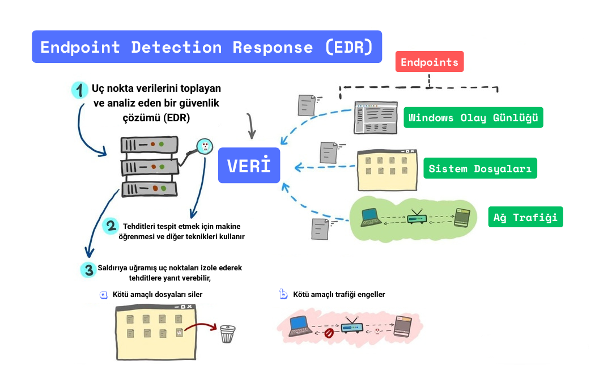

# EDR (Endpoint Detection and Response) Nedir? ve EDR Nasıl Çalışır?

## Giriş
Siber tehditler, günümüz dünyasının en büyük risklerinden biri haline geldi. Araştırmalar, siber suçların küresel ekonomiye maliyetinin her geçen yıl arttığını gösteriyor ve günlük hayatımızda bunu doğrudan hissetiğimiz anlar yaşanabiliyor. Bu durum, kurumların sadece teknolojik savunmalarla değil, stratejik yaklaşımlarla da güvenliklerini güçlendirmesini zorunlu kılıyor. İşte tam bu noktada,  uç nokta cihazlarını sürekli izleyerek tehditleri tespit eden ve hızlı müdahale sağlayan EDR (Endpoint Detection and Response) çözümleri devreye giriyor. <!-- truncate -->EDR, uç nokta cihazlarını sürekli izleyerek tehditleri tespit eden ve hızlı yanıt veren bir siber güvenlik teknolojisidir. Tam olarak Türkçeye “Uç nokta tehdit algılama ve müdahale, yanıt” olarak çevirebiliriz. Bu yazıda, EDR’nin ne olduğunu, nasıl çalıştığını, avantajlarını, kullanım alanlarını, zorluklarını ve geleceğini detaylı bir şekilde inceleyeceğiz.

## EDR Nedir?
Uç Nokta Algılama ve Yanıt (EDR), son kullanıcı cihazlarını (masaüstü bilgisayarlar, dizüstü bilgisayarlar, akıllı telefonlar, sunucular) sürekli izleyen ve bu cihazlarda ortaya çıkabilecek siber tehditleri tespit edip yanıt veren bir güvenlik çözümüdür. 2013 yılında Gartner analisti 
Anton Chuvakin tarafından tanımlanan EDR, günümüzde siber güvenlikte standart bir teknoloji haline gelmiştir.
### EDR’nin temel bileşenleri şunlardır:
- **Ajanlar (Agents):** Her uç noktaya yüklenen hafif yazılımlar, cihaz etkinliklerini izler ve veri toplar.
- **Merkezi Yönetim Konsolu (Centralized Management Console):** Güvenlik ekiplerinin tehditleri görüntülediği, analiz ettiği ve yanıt verdiği platform.
- **Tehdit İstihbaratı (Threat Intelligence):** En son saldırı vektörleri ve tehdit göstergeleri (IOC’ler, Indicator of Compromise) hakkında güncel bilgi sağlayan entegrasyonlar.
- **Yanıt Yetenekleri (Response Capabilities):** Tehditleri izole etmek, karantinaya almak ve olayları düzeltmek için otomatik ve manuel araçlar.

### EDR’nin geleneksel güvenlik çözümlerine (antivirüs, güvenlik duvarı) göre avantajları :
- **Sürekli İzleme:** 7/24 uç nokta etkinliklerini izler, gizli tehditleri tespit eder.
- **Davranış Analizi:** Bilinmeyen tehditleri, anormal davranışları analiz ederek bulur.
- **Olay Yanıtı:** Tehditleri yalnızca tespit etmekle kalmaz, hızlı müdahale sağlar.
- **Adli Analiz:** Olay sonrası analiz için detaylı veri sunar, gelecekteki saldırıları önlemeye yardımcı olur.

## EDR’nin Evrimi
EDR, 2013’te terim haline gelse de 2010’ların başında geleneksel antivirüs çözümlerine bir alternatif olarak ortaya çıktı. Bir süre sonra EDR, çözümleri yalnızca tehditleri tespit etmekle kalmıyor, aynı zamanda saldırı zincirine (Cyber Kill Chain) dair detaylı bilgiler sunarak güvenlik ekiplerinin daha etkili yanıt vermesini sağlıyordu.
EDR’nin evrimindeki bir sonraki adım, Genişletilmiş Algılama ve Yanıt (XDR) oldu. XDR (Extended Detection and Response), uç noktaların daha da önünde yer alarak ağ, bulut ve 
e-posta gibi diğer güvenlik alanlarını da kapsar. Birden fazla kaynaktan veri toplayarak daha bütüncül bir tehdit görünümü sunar ve daha hızlı, koordineli yanıtlar sağlar. Bugün, EDR ve XDR, geleneksel güvenlik araçlarının gözden kaçırabileceği gelişmiş tehditleri tespit etmek, araştırmak ve yanıt vermek için modern siber güvenlik stratejilerinde aktif olarak kullanılan teknolojilerdir.

## EDR Nasıl Çalışır?
EDR, uç noktalara yüklenen bir ajan aracılığıyla çalışır. Bu ajan, cihazda gerçekleşen tüm etkinlikleri kaydeder ve merkezi bir sunucuya iletir. Sunucu, bu verileri analiz ederek şüpheli davranışları veya tehditleri tespit eder ve gerekli müdahaleleri koordine eder. EDR’nin çalışma süreci şu adımlarla gerçekleşir:
1.	Veri Toplama: Uç noktadaki etkinlikler (dosya erişimleri, oturum başlatmaları, ağ bağlantıları, kayıt defteri değişiklikleri) sürekli olarak kaydedilir. Bu veriler, sistem süreçleri, kullanıcı davranışları ve ağ trafiği gibi geniş bir yelpazeyi kapsar.
2.	Veri Analizi: Toplanan veriler, makine öğrenimi modelleri, davranış analizi ve tehdit istihbaratı veri tabanları kullanılarak sunucularda incelenir. Normal davranışlardan sapmalar veya bilinen tehdit göstergeleri aranır. Yazının devamındaki gibi, bir dosyanın olağandışı bir şekilde şifrelenmesi fidye yazılımı belirtisi olabilir. Veya olağan dışı kaynak (RAM, disk, işlemci) kullanımı da tehdit belirtisi olabilir.
3.	Tehdit Algılama: Şüpheli bir etkinlik tespit edilirse (örnek olarak bir uygulamanın yetkisiz ağ bağlantısı kurması), bu bir tehdit olarak işaretlenir ve güvenlik ekiplerine bir uyarı gönderilir.
4.	Tehdit Yanıtı: Tespit edilen tehdit otomatik olarak karantinaya alınabilir (örneğin, şüpheli bir dosya izole edilir) veya güvenlik ekibi tarafından manuel olarak incelenir. Gerekirse cihaz ağdan izole edilir veya sistem temizlenir.
5.	Raporlama ve İzleme: Tüm olaylar kaydedilir ve güvenlik ekiplerine detaylı raporlar sunulur. Bu raporlar, olayın kapsamını, etkisini ve nasıl önlenebileceğini anlamak için kullanılır.

### Örnek Senaryo: Fidye Yazılımı Saldırısı
Şirketteki bir çalışanın yanlışlıkla zararlı bir e-posta ekini açtığını düşünelim. Bu ek, bir fidye yazılımı içeriyor ve çalışanın cihazındaki dosyaları şifrelemeye başlıyor. EDR sistemi, bu olağandışı dosya şifreleme etkinliğini tespit eder. Davranış analizi sayesinde, sistem bu etkinliğin normal olmadığını belirler ve fidye yazılımını karantinaya alır. Aynı anda, güvenlik ekibine bir uyarı gönderilir. Ekip, saldırının kaynağını ve etkilenen dosyaları analiz eder. Bu hızlı müdahale, fidye yazılımının ağda yayılmasını önler ve veri kaybını en aza indirir. Düzenli yedek alınan bir şirkette durum en az zararla atlatabilir.

## Kullanım Alanları
EDR çözümleri günümüzde her sektörde veri güvenliğini sağlamak için vazgeçilmez hale gelmiştir. Finans sektöründe müşteri verileri ve işlemleri korurken, sağlık alanında hasta bilgilerini güvence altına alır. Enerji sektöründe kritik altyapıları, perakendede ise müşteri ve ödeme verilerini korur. Eğitim kurumları, öğrenci kayıtları ve araştırma verileri için EDR'ye güvenirken, hükümet kurumları vatandaş bilgilerini ve ulusal güvenliği korumak için EDR çözümlerinden yararlanır. Siber tehditlerin işletme büyüklüğü gözetmeksizin herkesi hedef alması nedeniyle, EDR hem büyük hem de küçük ve orta ölçekli işletmeler için büyük öneme sahiptir.

&nbsp;

**EDR’nin çalışma mantığını bir görsel ile ifade etmek istedim.**

## EDR’nin Zorlukları ve Kısıtlamaları
- **Yanlış Pozitifler:** EDR sistemleri, aslında tehdit olmayan etkinlikleri tehdit olarak işaretleyebilir. Bu, güvenlik ekiplerini yorabilir ve gerçek tehditlerden dikkatleri dağıtabilir.
- **Nitelikli Personel Gereksinimi:** EDR’nin etkili bir şekilde kullanılması için, uyarıları yorumlayabilecek, olayları araştırabilecek ve uygun şekilde yanıt verebilecek nitelikli güvenlik personeline ihtiyaç vardır. 
- **Maliyet:** EDR çözümleri, özellikle küçük ve orta ölçekli işletmeler için maliyetli olabilir. Yazılım maliyetlerinin yanı sıra dağıtım, yönetim, elde edilen verileri depolama ve bakım için ek kaynaklar gerekebilir.

## EDR’nin Geleceği
- **XDR Entegrasyonu:** Yukarıda bahsettiğim Genişletilmiş Algılama ve Yanıt (XDR), EDR’nin bir evrimidir ve uç noktaların yanı sıra ağlar, bulut ortamları ve diğer kaynaklardan gelen verileri entegre eder. Bu, farklı güvenlik araçları arasındaki silolara son verir ve tek bir platformda tehdit algılama ve yanıt sağlar.
- **Yapay Zeka ve Makine Öğrenimi:** AI ve ML, daha doğru tehdit algılama, otomatik yanıt eylemleri ve gelecekteki saldırıları tahmin etmek için analitik araçlar sağlayarak EDR’de giderek daha önemli bir rol oynayacak.
- **Sıfır Güven Modeli (Zero Trust):** Hiçbir kullanıcıya, cihaza veya uygulamaya doğrudan güvenilmeyen Zero Trust yaklaşımında, EDR sistemleri uç noktalarda sürekli doğrulama ve anlık tehdit izleme görevini üstlenecek. Böylece, siber tehditlere karşı katmanlı bir savunma mekanizması oluşturulacak.

## Sonuç
EDR, günümüz siber güvenliğinin vazgeçilmez bir parçası haline geldi. Uç noktalardaki tehditleri hızlıca tespit edip müdahale ederek, veri güvenliği ve iş sürekliliği için oldukça önemli bir koruma sağlar. Kendine göre avantajları ve bazı kısıtlamaları mecvut. Genel olarak oldukça gelişmiş ve gelişmeye devam eden bir teknolojiden bahsettik. Gelecekte yapay zeka, XDR ve Zero Trust gibi teknolojilerle EDR’nin önemi daha da artacak. 

> [Berk Ali Erçelik](https://github.com/berkercelik)

 

