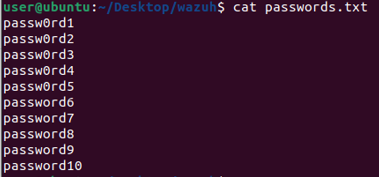

# Wazuh ile SIEM Ortamı Hazırlama

## 1. Sanal Ortam Hazırlama

Bu örnek SIEM senaryosunda Windows Server 2019 (Versiyon 1809) ve Ubuntu 22.04.5 LTS Desktop işletim sistemlerini kullandım. Windows için 2-4 GB, 2 CPU ve Linux için 4 GB, 2 CPU önerilen değerlerini kullandım. Windows Server üzerinde Ayarlar \> Remote Desktop (Uzak Masaüstü) sekmesinden RDP'yi saldırmak üzere senaryo gereği açtım. <!-- truncate -->


Windows Server IP: 192.168.28.129

Ubuntu IP: 192.168.28.131\
\
Ubuntu kurulumunu herhangi bir ek ayar yapmadan, sadece **net-tools, curl** gibi paketleri kurarak tamamladım. İki makineyi de VMware üzerinde NAT ağını seçerek ayağa kaldırdım. İkisinin de aynı ağda olduğundan emin oldum.


30 GB ve üzeri disk alanı tanımlamanız daha iyi olacaktır.

## 2. Wazuh Server Kurulumu


Bu aşamada Wazuh'un kendi dokümanını kullanarak ilerledim.\
"[Installation guide · Wazuh documentation](https://documentation.wazuh.com/current/installation-guide/index.html)" sayfasından sırasıyla Wazuh Indexer, Wazuh Server ve Dashboard'ın kurulumunu anlatacağım. Kendileri iki çeşit kurulum sunuyor. Adım adım olan daha detaylı ve Destekli Kurulum olan daha pratik bir şekilde ilerliyor. Daha hızlı ilerlemek için Destekli kurulum sayfalarından ilerledim.\
Öncelikle "wazuh" isimli bir dosya açarak işlemlere buradan açtığım terminalle devam ettim.

Dokümanı takip ederek;
```
curl -sO https://packages.wazuh.com/4.11/wazuh-install.sh

curl -sO https://packages.wazuh.com/4.11/config.yml
```
komutlarıyla gerekli ilk dosyaları indirdim. "config.yml" dosyasında Wazuh Server olarak kullanacağım Ubuntu makinenin IP'sini uygun alanlara yazdım.


Daha sonra `bash wazuh-install.sh \--generate-config-files` komutuyla kurulum için gerekli\
"wazuh-install-files.tar" dosyasını oluşturdum.
```
bash wazuh-install.sh \--wazuh-indexer node-1 ile Indexer kurulumu, ardından

bash wazuh-install.sh \--start-cluster komutu ile Indexer'i başlattım.
```


Bu kurulumdan sonra aşağıdaki komutla kurulumda tanımlanan node-1 için oluşturulan Keystore indexer_username ve indexer_password değerlerini bir kenara kaydediyoruz.\
**sudo** ile
```
sudo tar -axf wazuh-install-files.tar wazuh-install-files/wazuh-passwords.txt -O | grep -P "\'admin\'" -A 1
```


\# (Bu şifre değeri önemsiz olduğu için bu rehberde gizleme gereği duymadım.)

Daha sonra `curl -k -u admin:<Admin_şifreniz> https://<Wazuh_Indexer_IPniz>:9200` komutuyla beraber cluster kontrolü yaptım. 


Her şey yolunda gözüküyor.

Bir sonraki adımda `bash wazuh-install.sh --wazuh-server wazuh-1` komutuyla Wazuh Server kurulumu yaptım. Kurulumlar bazen uzun sürebilir, işlem tamamen bitene kadar iptal etmeyin.\
Sorunsuz kurulduktan sonra `bash wazuh-install.sh --wazuh-dashboard dashboard` komutuyla Ubuntu tarafındaki son kurulumu yaptım. Dashboard tarafında varsayılan port 443 olarak belirleniyor. Kurulumdan sonra giriş yapmamız için aynı username:password ekrana çıkıyor.


Kontrol etmek için giriş yapıyoruz. Ve API doğru şekilde ayarlanmış, çalışır durumda gözüküyor.


Aynı zamanda 
```
sudo systemctl status wazuh-manager 
sudo systemctl status filebeat
sudo systemctl status wazuh-indexer 
```
gibi komutlarla servislerin sistem üzerinden durumlarını kontrol ettim.

## 3. Wazuh Agent Kurulumu (Windows)

Windows Server tarafında internete rahat erişebilmek için öncelikle Server Manager Local Server kısmından "IE Enhanced Security Configuration" kısmını Off durumuna getiriyoruz.


Daha sonra farklı bir tarayıcı indirip oradan devam edebilirsiniz veya doğrudan

"[Installing Wazuh agents on Windows endpoints - Wazuh agent](https://documentation.wazuh.com/current/installation-guide/wazuh-agent/wazuh-agent-package-windows.html)" sayfasında bulunan Windows Installer ".msi" dosyasını indirebilirsiniz. Bu kurulumu yaparak GUI ile veya PowerShell üzerinden dokümanda belirtilen\
`.\wazuh-agent-4.11.2-1.msi /q WAZUH_MANAGER="192.168.28.131"` komutu ve ardından\
`NET START Wazuh`
komutuyla Windows Server tarafında Wazuh Agent servisini aktif hale getirdim.


Servisler kısmından kontrol ettiğimde çalışır durumda gözüküyor. İki makinenin haberleştiğinden emin olmak için ping atıyorum.


Wazuh arayüzüne tekrar döndüğümüzde makine bağlı şekilde gözüküyor.

## 4. Brute-Force Saldırısı İçin Alert (Uyarı) Oluşturma ve İnceleme

Wazuh, Windows Server üzerindeki brute-force saldırılarını algılamak için varsayılan olarak kural ID 60122'yi kullanır. Bu kural, Windows Security logundaki olay kimlikleri 4625 ve 529'u (başarısız oturum açma girişimleri) izler. Dolayısıyla hem manuel olarak hem de Wazuh Dashboard üzerinden ilgili kuralı kontrol ettim.


Wazuh üzerinde varsayılan kurulum halinde ilgili kural aktif gelmiş gözüküyor.

Aynı zamanda `sudo nano /var/ossec/ruleset/rules/0580-win-security_rules.xml` komutuyla da kontrol ettim.


Windows Server üzerinde `notepad "C:\Program Files (x86)\ossec-agent\ossec.conf"` konumundaki "ossec.conf" dosyasındaki **`<localfile\>`** kısımlarını kontrol ediyoruz. Yetki gerektirdiği için 
PowerShell'i **yönetici** olarak başlatın.




Artık emin olduğumuza göre saldırı için `sudo apt install -y hydra` komutuyla Hydra aracını indirerek devam edelim.

Bu aşamada "passwords.txt" adında bir dosya oluşturup rastgele şifreler yazabilirsiniz veya hazır listenizi kullanabilirsiniz. Hedef makinenin IP'si 192.168.28.129 olduğu için\
`sudo hydra -l randomuser -P passwords.txt rdp://192.168.28.129` komutu ile Remote Desktop Protokolü'ne bir saldırı deniyoruz. Arından Wazuh arayüzünü kontrol edelim.


Arayüzün anasayfasındaki Medium kısmına tıklayarak ilgili Discover sayfasına gidelim.


Ve Alert kısmında bir deneme olduğunu görüyoruz. Tıklayıp detaylarına baktığımda saldırı denemesinin içeriği net olarak anlaşılıyor.


Ayrıca Wazuh Threat Hunting sekmesinde de Authentication failure olarak denemeler gözüküyor.

Daha detaylı incelemek için Events kısmına geçtim. Burada gördüğümüz üzere **\"Logon Failure - Unknown user or bad password\" 60122** ve **\"Multiple Windows Logon Failures\" 60204** alertleri belirmiş. Seviye olarak çoğunlukla 5. Seviye yani orta düzey kabul ediliyor.


## 5. Özel Kuralı Sonradan Eklemek

Eğer Wazuh üzerinde ilgili kural olmasaydı, sonradan eklemek isteseydik ya da bu kurala bağlı bir kural eklemek istedeydik şu adımları takip etmemiz gerekirdi:


`/var/ossec/ruleset/rules/local_rules.xml` dosyasına

```
<rule id=\"100001\" level=\"10\"\>

<if_sid\>60122\</if_sid\>

<options\>no_full_log\</options\>

<description\>Brute-Force Saldırısı Tespit Edildi\</description\>

</rule\>
```

Kuralını ekleyerek ek bir Alert oluşturabiliriz.

Bu kurallara ek olarak daha önce bahsettiğim "ossec.conf" u düzenleyerek e-posta bildirimi de eklenebilir.\
Daha sonra kuralın aktif hale gelmesi için systemctl restart wazuh-manager komutuyla Wazuh yeniden başlatılır.

## Değerlendirme

Bu raporda genel olarak bir kurulum ve süreçten bahsettik. Ubuntu üzerinde Wazuh SIEM kullanılarak Windows Server 2019 sistemine yapılan brute-force saldırıları başarıyla algılandı. Varsayılan 60122 ve 60204 numaralı kurallar ile başarısız oturum açma girişimleri tespit edildi. Elde edilen sonuçlar, SIEM sistemlerinin güvenlik izleme süreçlerindeki önemini ve Wazuh'un bu alandaki etkinliğini göstermiş oldu.

> [Berk Ali Erçelik](https://github.com/berkercelik)
