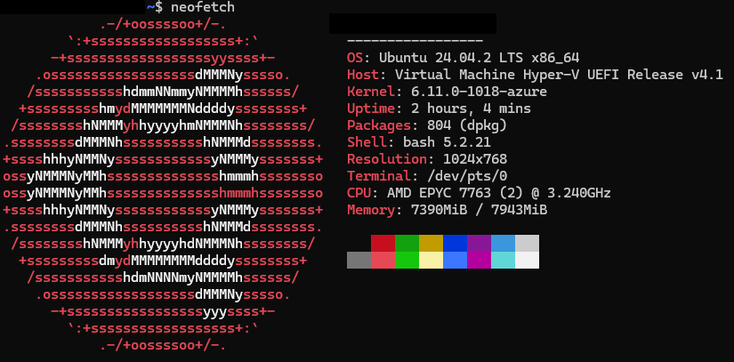
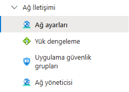
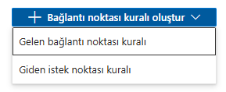
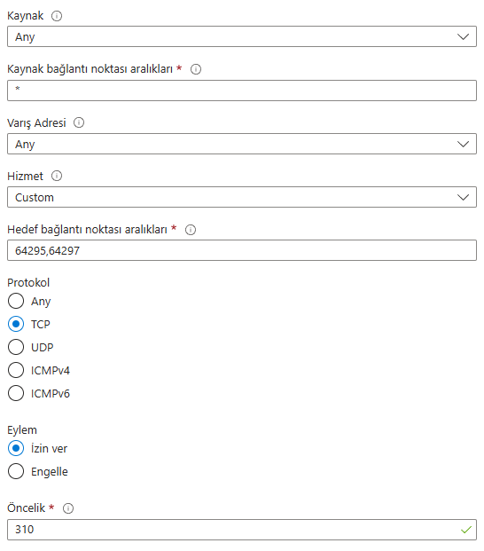
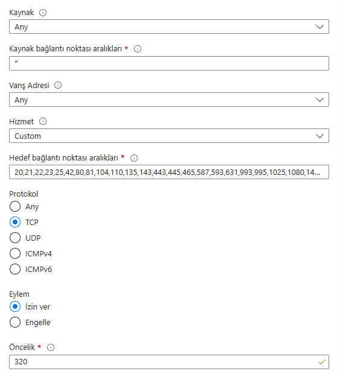
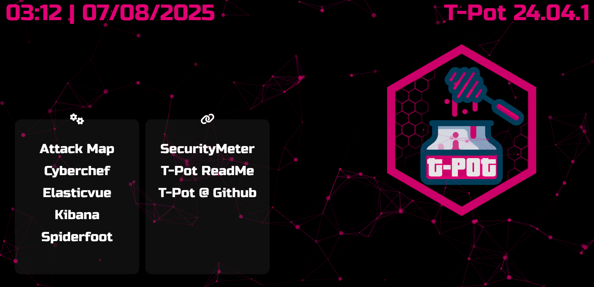
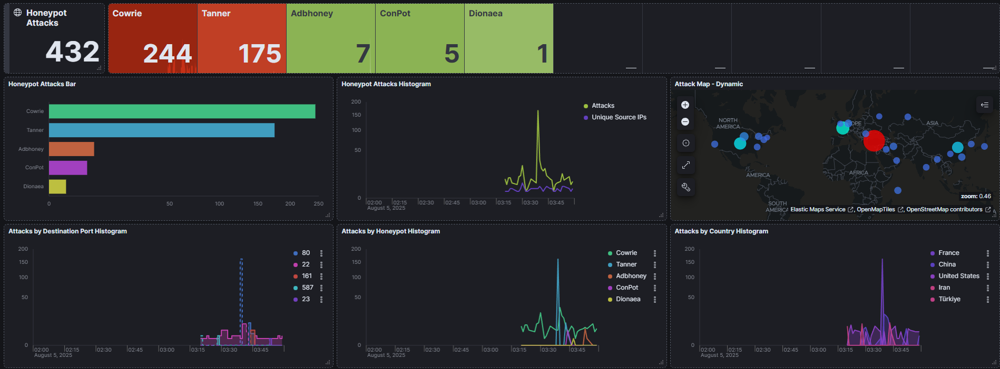
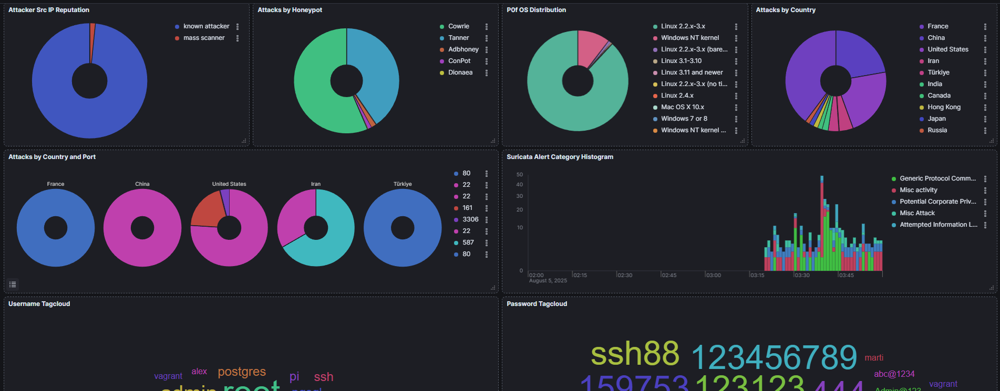
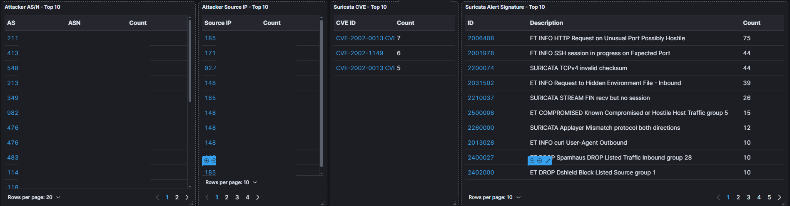

# Honeypot Projesi - T-pot Honeypot Kurulumu ve İlk İzlenimler - Bölüm 1

## Giriş

### Honeypot nedir?
Siber güvenlikte saldırganların davranışlarını, yöntemlerini ve araçlarını analiz etmek için tasarlanmış mış gibi davranan “tuzak sistemler”dir.

Amaç: Gerçek sistemleri korumak değil, saldırganları izlemek, veri toplamak ve analiz etmektir. Bu sayede aynı saldırı gerçek siteme uygulanmak isterse önceden önlem alabiliriz.

### T-Pot Honeypot nedir?
Telekom Security tarafından geliştirilen, Docker tabanlı ve açık kaynaklı bir projedir. Birden fazla senaryo ve portlar için farklı makineleri aynı anda çalıştırır. İçerisinde SSH, RDP, web uygulamaları, endüstriyel kontrol sistemleri gibi birçok hedef simülasyonu bulunur.

| [T-Pot Github Repo](https://github.com/telekom-security/tpotce)


 


### Neden bu projeyi kurdum?
  - Gerçek dünyadan gelen saldırı verilerini toplamak.
  - Farklı saldırı tiplerini gözlemlemek (brute force, exploit denemeleri, botnet bağlantıları vb.) ve analiz etmek.
  - SIEM/EDR entegrasyonu ile otomatik savunma senaryoları oluşturmak.

## Gereksinimler

Bu projeyi ayağa kaldırmak için minimum 8GB RAM ve 128GB disk alanına sahip bir sanal makine gerekli. (16GB RAM daha iyi olur.)
Biraz maliyetli olacağından eğer öğrenciyseniz Github Student Developer Pack ile Digital Ocean (yıllık 200$) veya Azure (yıllık 100$) kredileri alarak ücretsiz deneyebilirsiniz. Bu projede Microsoft Azure üzerinden devam ettim.

[Github Student Developer Pack](https://education.github.com/pack)

## Kurulum

### Docker Kurulumu



Sanal makine oluştururken Ubuntu 24.04.2 LTS kullandım. Güvenlik amaçlı SSH portunu şifreli girişe kapalı olarak başlattım ve SSH anahtar dosyasını ilgili konuma taşıdım. Daha sonra bağlandım.

`ssh -i C:\Users\Kullanici_adi\.ssh\id_rsa_dosyasi username@sunucu_ip`

Sunucuya erişim sağladıktan sonra güncellemeleri yapıyoruz.

```
sudo apt update
sudo apt install -y ca-certificates curl gnupg lsb-release
```

Daha sonra [Docker](https://www.docker.com/) ve Docker Compose yüklemek için bulunduğumuz dizine `install-docker.sh` dosyasını oluşturuyoruz.

`nano install-docker.sh`

```
#!/bin/bash

# Docker'ın Resmi GPG Key ve Repo'larını ekliyoruz.

sudo mkdir -p /etc/apt/keyrings
curl -fsSL https://download.docker.com/linux/ubuntu/gpg | sudo gpg --dearmor -o /etc/apt/keyrings/docker.gpg
echo \
  "deb [arch=$(dpkg --print-architecture) signed-by=/etc/apt/keyrings/docker.gpg] https://download.docker.com/linux/ubuntu \
  $(lsb_release -cs) stable" | sudo tee /etc/apt/sources.list.d/docker.list > /dev/null

# Docker Engine yükleme

sudo apt update
echo "Docker Engine yükleniyor..."
sudo apt install -y docker-ce docker-ce-cli containerd.io docker-buildx-plugin

# Kullanıcıyı Docker grubuna ekleme

echo "Kullanıcı Docker grubuna ekleniyor."
sudo usermod -aG docker $USER

# Docker Compose yükleme

echo "Docker Compose yükleniyor..."
DOCKER_COMPOSE_VERSION=$(curl -s https://api.github.com/repos/docker/compose/releases/latest | grep '"tag_name":' | sed -E 's/.*"([^"]+)".*/\1/')
sudo curl -L "https://github.com/docker/compose/releases/download/$DOCKER_COMPOSE_VERSION/docker-compose-$(uname -s)-$(uname -m)" -o /usr/local/bin/docker-compose
sudo chmod +x /usr/local/bin/docker-compose

# Docker sürüm kontrolü

docker --version
docker-compose --version

echo "Docker ve Docker Compose başarıyla kuruldu."
```

Bu bash scripti install-docker.sh dosyasına yazdım. Dosyayı kaydettikten sonra `chmod +x install-docker.sh` ile dosyayı çalıştırılabilir yaptık. 

Daha sonra `./install-docker.sh` ile scripti çalıştırdık.

### T-Pot Kurulumu

Bulunduğumuz `/home/username` diznine `git clone https://github.com/telekom-security/tpotce` ile T-Pot'u indiriyoruz.
`cd tpotce/` ile dizine giriyoruz.

`./install.sh` ile kuruluma başlıyoruz. Kullanıcı adı ve şifre belirliyoruz. Kurulum esnasında bitene kadar bekledikten sonra en son SSH ile 64295 portundan bağlanmanızı isteyen bir mesaj ekranda belirecek.

`### Done. Please reboot and re-connect via SSH on tcp/64295.`

Sistemi `sudo reboot now` ile yeniden başlatıp ilgili porta `ssh -i C:\Users\Kullanici_adi\.ssh\id_rsa_dosyasi username@sunucu_ip -p 64295` komutu ile bağlandım.

### Ağ Trafiğini Düzenleme

Eğer **Azure** kullanıyorsanız portlar sunucunuzda açık olsa bile Azure'a ait olan **Network Security Group (NSG)** üzerinde sistemin dışarından trafik alabilmesi için değişiklik yapılması gerekli. `ss -tuln` ile açık portlarınızı kontrol edebilirsiniz. Karşılığı 0.0.0.0 olan portlar tüm IP'lere açıktır.

```
Küçük bir örnek
...
tcp    LISTEN  0       4096            0.0.0.0:80             0.0.0.0:*      users:(("docker-proxy",pid=6192,fd=7))
tcp    LISTEN  0       4096            0.0.0.0:81             0.0.0.0:*      users:(("docker-proxy",pid=5664,fd=7))
tcp    LISTEN  0       4096            0.0.0.0:42             0.0.0.0:*      users:(("docker-proxy",pid=5635,fd=7))
tcp    LISTEN  0       4096            0.0.0.0:22             0.0.0.0:*      users:(("docker-proxy",pid=5484,fd=7))
...
```

NSG üzerinde değişiklik yapmak için sunucunun Azure sayfasına giriyoruz. Sol menüden **Ağ iletişimi > Ağ ayarları** kısmına geçiyoruz. 



Kurallar kısmında "Bağlantı noktası kuralı oluştur" ve ardından "Gelen bağlantı noktası kuralı" kısmına giriyoruz.



Burada öncelikle 64295,64297 portlarına izin vermemiz gerekiyor. Aşağıdaki görseldeki örneğe uygun olarak izin veriyoruz. İsterseniz kaynak olarak sadece kendi IP'nize izin verebilirsiniz.

 


Daha sonra T-Pot projesinin ihtiyacı olan tüm TCP portlara izin veriyoruz.


İlgili Portlar: `20,21,22,23,25,42,80,81,104,110,135,143,443,445,465,587,593,631,993,995,1025,1080,1433,1723,1883,2404,2575,27017,3000,3306,50100,5432,5555,5900,6379,8080,8443,9100,9200,10001`

ve bir kural daha ekleyerek aynı şekilde UDP seçerek `161,623,5000,5060` portlarına da izin veriyoruz. Oluşturduğumuz kuralların ismi herhangi bir isim olabilir. Öncelik değeri otomatik şekilde artar.

### Sunucunun Bazen Çökmesi

Sunucu çok yoğun bir trafik geldiğinde tamamen savunmasız olduğu ve istekleri sınırlamadığımız için çökebilir durumda. TPot Honeypot gibi yoğun trafik alan sistemlerde, özellikle kaynak yönetimi kritik öneme sahiptir. Sunucuya aşırı sayıda eş zamanlı bağlantı ve istek geldiğinde, işlemci, bellek ve disk gibi kaynaklar hızla tükenebilir. Eğer istek sınırlandırması yapılmazsa ve ağ trafiği doğru yönetilmezse, sunucu yanıt veremez hale gelip çökebilir. Bu durumda sistemi yeniden başlatmamız gerekir.

## T-Pot Arayüzü

Tarayıcı üzerinden `https://sunucu_ip:64297` ile T-Pot arayüzüne erişiyoruz. İlk yükleme biraz uzun sürebilir. Belirlediğimiz kullanıcı adı ve şifre ile giriş yapıyoruz.

Buradan çeşitli servisleri izleyebiliriz. Attack Map ile hangi IP'den hangi protokole, porta istek atıldığını anlık olarak harita üzerinde görebiliriz.
Kibana kısmı projenin merkezi denebilir. Sunucuda çalışan tüm makinelerin istatistikleri burada tutuluyor ve grafikler halinde sunuluyor.



## İlk İzlenimler

İlk çalıştırdığımız anda bile sunucuya botlar tarafından bağlantılar gelmeye başlar. Özellikle 22 (SSH), 80 (HTTP) ve 445 (SMB) portları yoğun hedeflenir. Cowrie (SSH/Telnet), Dionaea (malware yakalama), Tanner, H0neytr4p gibi farklı modüller aktif. Kibana üzerinde saldırı kaynakları (ülke, IP), kullanılan kullanıcı adları/şifreler, exploit denemeleri canlı olarak takip edilebiliyor. Suricata Alert Signature, Top IP listeleri, saldırı trend grafikleri, ilgili CVE'ler ve birçok bölüm mevcut. 

Bazı IP'lere [Talos](https://www.talosintelligence.com/reputation_center) ile baktığımda Email Reputation değerleri ve Block Lists değerleri ilgili IP'nin spam olarak işaretlediğini belirtiyor. 





> Eğer bu salgırgan sunucu ilerde kapanır ve aynı IP hosting hizmeti tarafından başka bir kullanıcının sunucusuna atanırsa yeni kullanıcı bu değerlerden dolayı çeşitli problemler yaşayabilir. Bu kara listeyi ve mail itibar sorununu çeşitli prosedürleri takip ederek düzeltebilir.

## Sonuç

T-Pot Honeypot kurulumu ile saldırıya açık, zaafiyetli bir sunucu oluşturduk. Bu sayede gerçek dünyadan gelen saldırı trafiğini gözlemleyebiliyor, farklı saldırı tekniklerini ve hedeflerini detaylı şekilde analiz edebiliyoruz. Aynı zamanda savunma mekanizmalarımızı geliştirmek için değerli veri sağlıyor. Ancak bu noktadan sonra sunucunun kaynak tüketimine ve iyi yapılandırılmış olmasına dikkat ederek ilerlemeliyiz. 

Sonuç olarak, T-Pot kurulan bir sunucu, siber güvenlik alanında analiz, izleme ve savunma geliştirme konusunda güzel bir deneyim sağlar.

Bu rehber, Ağustos 2025 itibarıyla T-Pot Honeypot’un en güncel versiyonuna göre hazırlanmıştır.