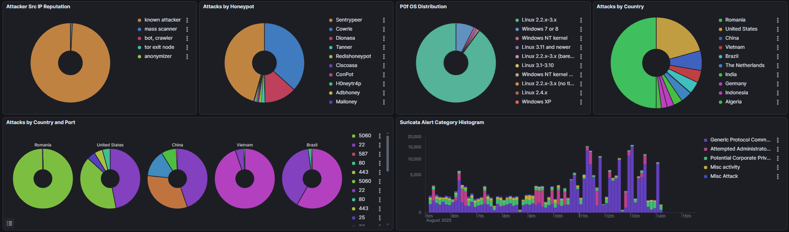
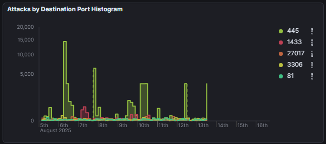

# Honeypot Projesi - Kapsamlı T-Pot Honeypot Veri Analizi ve Elasticsearch & Kibana Rehberi - Bölüm 2

## Giriş

Bir önceki bölümde T-Pot Honeypot kurulumundan ve ilk gözlemlerimizden söz etmiştim. Bu bölümde ise yaklaşık 8 gün boyunca açık kalan T-Pot Honeypot’un ürettiği verileri ayrıntılı şekilde ele alacağız. Öncelikle kullanılan teknolojilere değinecek, ardından Elasticsearch ve Kibana ile veri inceleme sürecine dair bir rehber sunacağım. Sonrasında genel analiz sonuçlarını paylaşarak, her bir senaryo makinesini ayrı başlıklar altında detaylı biçimde değerlendireceğiz. Bölümün sonunda ise Suricata İmzaları ve CVE'ler üzerinden ek bir inceleme yaparak, projeyi kapsamlı bir değerlendirme ile tamamlayacağız.

<!-- truncate -->

## Önceki Bölümden 

### Honeypot nedir?
Siber güvenlikte saldırganların davranışlarını, yöntemlerini ve araçlarını analiz etmek için tasarlanmış mış gibi davranan “tuzak sistemler”dir.

Amaç: Gerçek sistemleri korumak değil, saldırganları izlemek, veri toplamak ve analiz etmektir. Bu sayede aynı saldırı gerçek siteme uygulanmak isterse önceden önlem alabiliriz.

### T-Pot Honeypot nedir?
Telekom Security tarafından geliştirilen, Docker tabanlı ve açık kaynaklı bir projedir. Birden fazla senaryo ve portlar için farklı makineleri aynı anda çalıştırır. İçerisinde SSH, RDP, web uygulamaları, endüstriyel kontrol sistemleri gibi birçok hedef simülasyonu bulunur.

| [T-Pot Github Repo](https://github.com/telekom-security/tpotce)


## 1. Techstack ve Veri Akışı, Teknik Altyapı
Toplanan verilerin işlenmesi ve analizi için bu projede Elasticsearch ve Kibana sayesinde yaygın ve güçlü bir teknoloji yığını kullanılmıştır.

### Elasticsearch
T-Pot tarafından toplanan tüm log kayıtları ve saldırı verileri, dağıtık bir arama ve analiz motoru olan Elasticsearch'e gönderilir. Elasticsearch, bu verileri neredeyse gerçek zamanlı olarak indeksleyerek sorgulanabilir ve analiz edilebilir hale getirir. Bu, onu "büyük veri için yüksek performanslı bir arama motoru" yapar. Elasticsearch API aracılığyla çalıştığı için Kibana ile oluşan tablolar ve yaptığımız sorgular da POST / GET istekleri sayesinde çalışır. Arayüz olmadan gerekli parametreleri girerek "curl" ile de istek atılabilir, veriler çekilebilir.

### Kibana
Elasticsearch üzerinde çalışan bir veri görselleştirme platformudur. Ham verileri anlamlı grafiklere, tablolara, haritalara ve panolara dönüştürür. Kibana, "verilerin hayat bulduğu ve anlaşıldığı gösterge paneli" olarak işlev görerek, karmaşık veri setlerindeki desenleri ve anomalileri kolayca tespit etmemizi sağlar.

Ana bölümleri:
* Discover → Ham veriyi inceleme
* Visualize / Lens → Grafik oluşturma
* Dashboard → Birden fazla görselleştirmeyi tek sayfada toplama
* Alerts → Belirli koşullarda e-posta/webhook tetikleme
* Dev Tools → Elasticsearch API’si ile çalışmak

### Diğer Kısımlar (Attack Map, CyberChef, Elasticuve, Spiderfoot)


#### Attack Map (Saldırı Haritası)
* Amaç: Anlık saldırıları dünya haritası üzerinde görselleştirir.
* Rol: Durumsal farkındalık sağlar, saldırıların coğrafi dağılımını gösterir.
* Kullanım: SOC ekranlarında görsellik, anomali fark etme, sunumlarda etki.

#### CyberChef

* Amaç: Veri işleme ve dönüştürme için “Siber İsviçre Çakısı”. Bu ismi gerçekten hakediyor, çakı gibi çok fazla işlevi var. Lokalde de çalıştırabilirsiniz, web tabanlıdır.
* Rol: Honeypot verilerinde gizlenmiş veya kodlanmış saldırgan komutlarını çözümleme.
* Kullanım: Kod çözme (Base64, Hex, URL encode vb.), IOC çıkarma (IP, domain, e-posta), Basit şifre çözümleri (XOR vb.)

#### Elasticvue

* Amaç: Elasticsearch için hafif, web tabanlı yönetim aracı.
* Rol: Kibana analiz için kullanılırken, Elasticvue ham veri ve indeks yönetimi için kullanılır.
* Kullanım: Logları JSON formatında inceleme, indeks sağlığını kontrol etme, hızlı sorgular.

#### Spiderfoot

* Amaç: OSINT otomasyon aracı, hedef hakkında açık kaynaklardan bilgi toplar.
* Rol: Honeypot’un yakaladığı saldırgan IP’leri zenginleştirerek profilleme ve altyapı keşfi sağlar.
* Kullanım: Veri zenginleştirme, Saldırgan profillemesi, Altyapı keşfi (ilgili IP’ler, domainler, C2 sunucuları)

### Veri Akışı Şeması
T-Pot Honeypot Servisleri (Cowrie, Dionaea vb.) -> Log Kayıtları -> Elasticsearch (İndeksleme ve Depolama) -> Kibana (Görselleştirme ve Analiz)

### KQL ve ES|QL: Sorgulama Dilleri Farkı

Kibana'da veri sorgularken temel olarak iki dil kullanılır.
#### KQL
* KQL (Kibana Query Language): Kibana'nın üst kısmındaki arama çubuğunda kullandığınız basit ve kullanıcı dostu dildir. 
* Amacı: Veriyi interaktif olarak filtrelemek ve keşfetmektir.
* Sözdizimi (Syntax): Basittir. alanAdı: "değer" veya alanAdı > 100 şeklinde yazılır. Otomatik tamamlama özelliği vardır.
* Genellikle hızlı filtreleme ve keyword search için idealdir.
* Sadece Kibana UI üzerinde çalışır (Elasticsearch API’ye direkt gönderilemez).

#### KQL Sorgu Örnekleri

* `eventid.keyword : cowrie* and src_ip: 198.51.*`
* `type.keyword : "Cowrie" and username.keyword : root and password.keyword : root and eventid.keyword : cowrie*`
* `@timestamp >= now-24h AND NOT destination.ip: "192.168.*"`
* `src_ip : "192.168.1.100" AND event_type.keyword : "ssh"`

#### ES|QL
* ES|QL (Elasticsearch Query Language): Elasticsearch'ün yeni ve çok daha güçlü, SQL'e benzeyen sorgulama dilidir.
* Doğrudan Elasticsearch API’sinde çalışır (Kibana bağımlı değildir).
* Amacı: Sadece filtreleme değil, aynı zamanda veri üzerinde dönüşüm, zenginleştirme ve karmaşık hesaplamalar yapmaktır. Veriyi görselleştirmeden önce yeniden şekillendirmenizi sağlar.
* Sözdizimi: SQL'e çok benzer. `FROM index | WHERE koşullar | STATS ... BY grup` gibi komutlar içerir.
* Örnek: 
```
FROM "logstash-*"
| WHERE event.module == "cowrie"
| STATS
    success_count = COUNT_IF(event.outcome == 'success'),
    failed_count = COUNT_IF(event.outcome == 'failure')
    BY source.ip
| SORT success_count DESC
``` 

(Cowrie için her bir IP'nin başarılı ve başarısız giriş denemelerini sayar).

Kısaca, hızlı filtreleme ve keşif için KQL, raporlama ve derin analiz için veri setini yeniden yapılandırmanız gerektiğinde ise ES|QL kullanılır.


## 2. Elasticsearch ve Kibana Kullanımı

Öncelikle bu projede çok fazla veri birikiyor. Tüm veriler bir yana makineleri ayrı ayrı analiz etmek çok zaman alan bir süreç. Çok fazla veri olduğu için bir miktar yavaş çalışma bazen gözlenebilir. İlk başta gelen Dashboard'ı komple değiştirebilirsiniz. Yeni görsel paneller ekleyebilirsiniz. İstediğiniz sorgulara bağlı bu paneller görselleştirme yaparak kolay anlaşılabilirlik sağlar. 

### Filtre Uygulama

Tarih aralığı seçimi yapabiliriz, Dashboard düzenini değiştirebiliriz, herhangi bir grafiğin sağ üstte beliren menüsünden "Inspect" kısmından istediğimiz veriyi "+" butonu ile filtreleyebiliriz. Bu sayede sadece filtreyi kapsayan ve filreyle ilgili veriler görünür hale gelir.


Bu filtreler çok daha spesifik olabilir. Örneğin parola denemesinde "123456" kullanılan loglar ekrana gelir.


### Menüler

Elasticsearch içerisinde çok detaylı menü ve başlıklar var. Burada bizi en çok ilgilendiren temel başlıklar Analytics altında Dashboards ve Discover, Security sekmesi altında Dashboards, Management altında Stack Management olarak tanımlanabilir. Diğer kısımlardan da Elasticsearch'ün sağladığı işlevleri uygulayabilirsiniz.


**Management > Data > Index Management** kısmında tutulan log kayıtlarının genel durumunu görüntüleyebiliriz. Bir `logstash-*` dosyasının üstüne tıklayarak detaylara inebiliriz. Mappings kısmından tutulan loglardaki her veri için ayrıca tutulmuş etiketleri liste veya JSON formatında görüntüleyebiliriz. 


Management > Kibana > Saved Objects kısmından daha önceden oluşturulmuş Kibana'ya ait grafikleri objeler olarak görüntüleyebiliriz. Dışa aktarımı sağ üstten Export kısmından yapabiliriz. "export.ndjson" olarak dışa aktarılır.


### Kayıtları (Log) Dışa Aktarma

Örnek olarak Analytics > Discover sayfasına gelelim. Hiç bir filtre uygulamadığımız zaman 6,6 milyon log olduğu sorgulanıyor. 


Örnek olarak `eventid.keyword : cowrie* AND username.keyword : root AND password.keyword : *` sorgusunu girersek Cowrie makinesine root:* (herhangi bir kelime) username:password denemesi ile yapılan giriş denemelerini görmüş oluruz.


Bunu dışa aktarmak için sağ üstteki Share > Export butonuna bastıktan sonra "Generate CSV" seçiyoruz ve uyguluyoruz. Dışa aktarılan dosyalar **Management > Alerts and Insights > Reporting** sekmesinde hazırlanıyor ve hazır olunca indiriliyor. Eğer büyük sayıda olan bir sorguyu dışa aktarmak istiyorsanız muhtemelen hepsini aktaramayacaktır. Veri büyüklüğüne bağlı olarak belli bir noktadan sonra eksik olarak dosyayı oluşturacaktır.

`https://sunucuIP:64297/kibana/app/management/insightsAndAlerting/reporting` adresinde oluşturulan raporlar listelenir.


Daha detaylı analizler için eğer erişim varsa direkt Elasticsearch API ile veriler de çekilebilir. Her istekte sınır 10 bindir. Bazı araçlarla parça parça büyük bir log indirilebilir.

### Örnek Log İncelemesi


Aynı şekilde Discover sayfasından istediğimiz filtreyi uygulayarak; örnek `type.keyword : "Suricata"  AND dest_port: 80 and payload_printable.keyword : GET *` sorgusuyla bir saldırganın **Command Injection** denemesi ile kendi sunucusundan Honetpot'un `/tmp` klasörüne dosya indirmeye çalışıyor. Bu saldırıyı üzerine tıklayarak filtrelediğimizde aynı anda dört farklı kuralı birden ihlal ettiğini farkediyoruz. 


1. İlk Log: Bu saldırı, bilinen bir zafiyet olan CVE-2016-20016 ile eşleşen bir "Web Uygulama Saldırısıdır".

2. İkinci Log: Bu saldırı, genel bir "Web Uygulama Saldırısı" kuralını daha tetiklemiştir (Belki de wget ve sh komutlarının aynı anda kullanılmasından dolayı).

3. Üçüncü Log: Bu saldırının amacı "Yönetici Ayrıcalıkları Kazanma Girişimi" olarak değerlendirilmiştir ve IoT  cihazlarını hedeflemektedir.

4. Dördüncü Log: Bir önceki maddeyi destekler şekilde, yine "Yönetici Ayrıcalıkları Kazanma Girişimi" ve IoT hedefli olduğuna dair başka bir kural daha bu paketi tehlikeli olarak işaretlemiştir.

### API ve Konsol Kullanımı

Discover > Inspect> View:Request sekmesinden > Open in Console veya herhangi bir grafiğin Inspect butonundan sonra View:Requests olarak seçiyoruz. Burada Request (İstek) ve Response (Dönüt) sekmelerini görüntüleyebiliriz.

`https://sunucuIP:64297/kibana/app/dev_tools#/console/shell`


Konsol açtığımızda istediğimiz filtreyi manuel olarak ekleyerek sorguyu çalıştırabiliriz.

```
"filter": [
  {
    "term": { "dest_port": 22 }
  },
  {
    "wildcard": { "eventid.keyword": "cowrie*" }
  },
  {
    "range": {
      "@timestamp": {
        "gte": "2025-08-04T21:00:00.000Z",
        "lte": "2025-08-15T16:17:14.240Z"
      }
    }
  }
]
```


## 3. Genel Saldırı İstatistikleri (Makro Analiz)

İlk başta total verilerle başlayalım.

### 1. Toplam Saldırı Sayısı

* Toplam: 5 Ağustos'tan itibaren 8 gün boyunca toplam **380,127 saldırı** denemesi yapıldı.
* Yoğunluk: **82,784 saldırı** ile 8 Ağustos'ta zirve, en yoğun tekil saldırı yaşandı.
* Trend: Günlük ortalama **35,942 saldırı** yapıldı.





### 2. Coğrafi Dağılım (GeoIP)
**En çok saldırı gerçekleştiren ülkeler:**

* Romanya – %50
* ABD – %21
* Çin – %7
* Vietnam – %4
* Brezilya – %4
* Diğer – %14

### 3. Hedef Alınan Servisler ve Portlar

| Honeypot      | Atak Sayısı |
| ------------- | ------------ |
| Sentrypeer    | 172,687     |
| Cowrie        | 139,030      |
| Dionaea       | 49,066       |
| Tanner        | 5,590        |
| Redishoneypot | 3,718        |
| Ciscoasa      | 1,866        |
| ConPot        | 1,663        |
| H0neytr4p     | 1,617        |
| Adbhoney      | 1,606        |
| Mailoney      | 1,348        |


| Honeypot Adı      | Servisler / Protokoller                        | Portlar                                                                                     | Trafik Oranı |
| ----------------- | ---------------------------------------------- | ---------------------------------------------------------------------------------------------- | ------------ |
| **Sentrypeer**    | SIP                                            | 5060                                                                                             | %46          |
| **Cowrie**        | SSH, Telnet Honeypot                           | 22 (SSH), 23 (Telnet)                                                                          | %37          |
| **Dionaea**       | HTTP, HTTPS, FTP, TFTP, **SMB**, MSSQL, MySQL, SIP | 80 (HTTP), 443 (HTTPS), 21 (FTP), 69 (TFTP), **445 (SMB)**, 1433 (MSSQL), 3306 (MySQL), 5060 (SIP) | %13          |
| **Tanner**        | Web / Exploit Tabanlı Honeypot                 | Genellikle **80**, 443                                                                 | %1           |
| **Redishoneypot** | Redis DB Honeypot                              | 6379                                                                                           | %1           |
| **Diğer**         | Çeşitli servisler                              | Farklı portlar                                                                                 | %2           |

**Aslında bu noktada belli bir güne kadar Cowrie hep öndeydi ve Cowrie grafiklerde de görüldüğü üzere süreç boyunca devamlı denenmeye devam etti. Tekil bir saldırgan ısrarla Sentrypeer makinesini 2 kez yüksek boyutta hedef alarak istatistiği yükseltti.**

**Ayrıca saldırı yapan makinelerin %90'ı "Linux 2.2.x-3.x" %7'si "Windows 7 veya 8" ve geri kalanı ise çoğunlukla Linux makinelerden oluşuyor.**

### 4. En Yaygın Kullanıcı Adı / Parola Denemeleri

| Username (Kullanıcı Adı) | Deneme Sayısı  | Password (Parola) | Deneme Sayısı  |
| -------- | ------------------------- | --------- | ---------------------- |
| root     | 7,858                     | 123456    | 2,681                  |
| sa       | 905                       | 123       | 552                    |
| admin    | 882                       | password  | 438                    |
| oracle   | 490                       | admin     | 327                    |
| user     | 444                       | (empty)   | 289                    |
| postgres | 385                       | abc123    | 289                    |
| test     | 309                       | 1         | 255                    |
| ubuntu   | 303                       | 12345678  | 210                    |
| www      | 272                       | 1234      | 209                    |
| ftpuser  | 260                       | 123456789 | 178                    |
| pi       | 249                       | 111111    | 176                    |
| hadoop   | 247                       | 12345     | 166                    |
| es       | 227                       | root      | 155                    |
| mysql    | 226                       | admin123  | 137                    |
| steam    | 218                       | test      | 121                    |


### 5. En Çok Saldırı Yapan IP’ler ve İlgili ASN'ler

| Source IP  | Atak Sayısı   |
| ---------- | ------- |
| 2.57.\*    | 159,935 |
| 96.44.\*   | 8,406   |
| 196.251.\* | 5,917   |
| 134.199.\* | 5,656   |
| 131.0.\*   | 5,191   |
| 45.186.\*  | 5,098   |
| 20.192.\*  | 3,744   |
| 129.212.\* | 3,546   |
| 173.231.\* | 3,483   |
| 114.55.\*  | 3,392   |
| 179.148.\* | 3,158   |
| 2.177.\*   | 3,156   |


**ASN**, Autonomous System Number (Otonom Sistem Numarası) demektir. Bunu şöyle düşünebiliriz. İnternetteki her büyük ağ (örneğin bir internet servis sağlayıcısı, bir veri merkezi şirketi veya büyük bir kurumun ağı) bir otonom sistemtir. ASN, BGP (Border Gateway Protocol) üzerinden internette yönlendirme yapan ağların kimlik numarasıdır. 

İnternetteki IP blokları (IPv4 veya IPv6) bu ASN’lere tahsis edilir. Her ASN, bir organizasyona veya servis sağlayıcıya aittir. En çok saldırı gelen ilk ASN'yi [mxtoolbox](https://mxtoolbox.com/SuperTool.aspx?action=asn%3a47890) üzerinden araştırdığımızda `Total amount of IPs for this ASN: 9,728` yazısını görüyoruz. 

Ve bu ASN'yi kenarındaki "+" butonu ile filtreye eklediğimizde buradan gelen diğer tüm IP'ler ve diğer grafikler de filtreleniyor. Bu ASN için özel bir filtre, kural yazabiliriz. IP engelleme veya rate limit gibi önlemler düşünülebilir.

Örnek olarak en yüksek değerli ASN'yi filtrelediğimde Sentrypeer ve Cowrie makinelerine denemeler yaptığını görüyoruz.


Özellikle Solana ile alakalı user:pass komboları denendiği analiz ediliyor.

İkinci en yüksek değerli ASN'yi filtrelediğimde Cowrie makinesine birden fazla IP ile saldırı yapıldığını farkettim.


Farklı bir ASN filtrelediğimde birden fazla portun (Honeypot makinelerinin) denendiğini analiz ediyoruz. Birden fazla ülke ve birden fazla port farklı zamanlarda saldırıya uğramış.


IP Adresi	Ülke	Saldırı Sayısı	IP Reputation
45.67.89.101	Çin	4.532	Kötü
91.203.45.78	Rusya	3.980	Kötü
103.45.76.210	Vietnam	3.412	Kötü

> En çok saldırı yapan 10 IP adresinin 5 tanesi Block List'lerde yer alıyor olarak gözüküyor. 6 tanesi ise IP Reputation olarak "Poor" durumda gözüküyor. Ek olarak "Attacker Src IP Reputation" grafiğinde %99 oranında "known attacker" vardır. Daha önceden tehdit istihbarat servisleri tarafından zaten "bilinen saldırgan" olarak fişlenmiş IP adresleridir.

## 4. Detaylı Saldırı İncelemeleri (Mikro Analiz)

Bu bölümde Security > Dashboards sekmesi altından her senaryo için oluşturulmuş makinelerin sayfalarına giderek inceleyeceğiz.

### Senaryo 1 - Sentrypeer 


Sentrypeer, özellikle SIP (Session Initiation Protocol) protokolünü hedef alan saldırıları yakalamak için tasarlanmış bir VoIP (Voice over IP) honeypot'udur. Panodaki (Dashboard) veriler, VoIP sistemlerinin internet üzerinden sürekli ve otomatik saldırılara maruz kaldığını açıkça göstermektedir. Saldırıların temel amacı, sistemlerdeki zayıf kimlik bilgilerini (dahili numara ve parola) tespit ederek bu sistemleri ele geçirmektir.

Saldırıların büyük bir çoğunluğu REGISTER metodu kullanılarak yapılıyor. Bu brute force (kaba kuvvet) saldırısı, telefon santrali üzerinde geçerli bir dahili numara ve parola kombinasyonu bularak kendilerini sisteme kaydettirmeye çalıştıklarını gösterir. 

İkinci en yaygın metot olan OPTIONS, genellikle keşif amacıyla kullanılır. Saldırganlar bu metotla, hedef IP adresinde çalışan bir SIP sunucusu olup olmadığını ve hangi özellikleri desteklediğini anlamaya çalışır.

> Unique SrcIPs: 9,800

> 


### Senaryo 2 - Cowrie

Cowrie honeypot'u, SSH ve Telnet protokolleri üzerinden gelen kaba kuvvet (brute-force) saldırılarını ve sızma sonrası aktiviteleri yakalamaktadır. Bu saldırının neredeyse tamamen otomatikleştirilmiş olduğu anlaşılıyor. Gelen saldırıların büyük çoğunluğu, sunuculara ve IoT cihazlarına uzaktan erişim için kullanılan SSH portunu hedef almaktadır. Saldırıların büyük bir kısmı daha önce de bahsettiğimiz gibi bilinen saldırganlara ait IP'lerden gelmiştir. 

Sızma sonrasında keşif amaçlı `uname -a` gibi keşif komutları kullanmışlardır. Amaç sistemin mimarisini öğrenmektir. İndirilen dosyalardan da görüldüğü gibi sistem mimarisine göre hazırlanmış `retail` isimli dosyalar mevcut.

En çok denenen komutlar


> Unique SrcIPs: 2,650

> Unique HASSHs: 50

### Senaryo 3 - Dionaea

Burada 32526 portunu es geçiyoruz çünkü sadece yerel IP olan 10.1.0.4 adresinden geliyor, diğer makinelerde de mevcut. Dionaea görüldüğü üzere "SMBD" başta olmak üzere MSSQL, MongoDB, MySQL gibi veritabanlarını taklit ediyor. SMB protokolünü (Port 445) hedeflenmiştir. Windows ağlarında dosya paylaşımı için kullanılan bir protokoldür. Zayıf user:pass komboları denenmiştir. SMB'nin gölgesinde kalsa da, saldırganlar HTTP (Port 80), MSSQL (Microsoft SQL Server) (Port 1433), MySQL (Port 3306) ve MongoDB (Port 27017) gibi diğer servisleri de aktif olarak taramaktadır. Bu da bizlere saldırganların açıkta ne varsa bulmaya çalıştığını gösteriyor.





### Senaryo 4 - Tanner

Tanner, bir web sunucusunu taklit ederek HTTP (Port 80) tabanlı saldırıları, zafiyet taramalarını ve keşif girişimlerini yakalayan bir honeypot'tur. Analiz, internete açık olan herhangi bir web sunucusunun, bilinen zafiyetleri ve yaygın yapılandırma hatalarını arayan otomatik araçlar tarafından sürekli olarak tarandığını göstermektedir. Her ne kadar bu raporu hazırlarken sonlara doğru grafikte yer alsam da orayı görmezden gelebiliriz.

* Saldırganlar, veritabanı parolaları ve API anahtarları gibi kritik bilgileri içeren /.env, /config.php ve /.git/config gibi dosyaları ele geçirmeye çalışmaktadır.
* /vendor/phpunit/src/Util/PHP/eval-stdin.php yoluna yapılan istekler, PHPUnit (CVE-2017-9841)'deki bilinen ve uzaktan kod çalıştırmaya (Remote Code Execution) olanak tanıyan kritik bir zafiyeti sömürme girişimleridir.
* /swagger (API arayüzleri), /containers/json (Docker API) gibi yolların taranması, saldırganların korunmasız bırakılmış servisleri aradığını göstermektedir.


| Tanner URI                                             | Sayısı |
| ------------------------------------------------------ | ----- |
| /                                                      | 525   |
| /admin/config.php                                      | 91    |
| /favicon.ico                                           | 75    |
| /.env                                                  | 74    |
| /config.php                                            | 33    |
| /robots.txt                                            | 23    |
| /.git/config                                           | 20    |
| /backend/.env                                          | 17    |
| /api/swagger                                           | 15    |
| /swagger                                               | 15    |
| /vendor/phpunit/phpunit/src/Util/PHP/eval-stdin.php    | 15    |
| /boaform/admin/formLogin                               | 14    |
| /containers/json                                       | 14    |
| /V2/vendor/phpunit/phpunit/src/Util/PHP/eval-stdin.php | 12    |
| /admin/config.php?password%5B0%5D=ZIZO\&username=admin | 12    |

| Tanner HTTP User Agent                           | Count |
| --------------------------------------------------------------------------- | ----- |
| Mozilla/5.0 (Windows NT 10.0; Win64; x64) AppleWebKit/537.36 (KHTML, like Gecko) Chrome/91.0.4472.124 Safari/537.36                                                                                                          | 2,959 |
| libredtail-http                                                                                                                                                                                                              | 440   |
| Mozilla/5.0 (iPhone; CPU iPhone OS 13\_2\_3 like Mac OS X) AppleWebKit/605.1.15 (KHTML, like Gecko) Version/13.0.3 Mobile/15E148 Safari/604.1                                                                                | 311   |
| Mozilla/5.0 (Windows NT 10.0; WOW64; Trident/7.0; yie11; rv:11.0) like Gecko                                                                                                                                                 | 276   |
| Mozilla/5.0 (compatible; MSIE 10.0; Windows NT 6.1; WOW64; Trident/6.0; SLCC2; .NET CLR 2.0.50727; .NET CLR 3.5.30729; .NET CLR 3.0.30729; .NET4.0C; .NET4.0E)                                                               | 276   |
| curl/7.81.0                                                                                                                                                                                                                  | 181   |
| Mozilla/5.0 (Windows NT 10.0; Win64; x64) AppleWebKit/537.36 (KHTML, like Gecko) Chrome/116.0.5845.140 Safari/537.36                                                                                                         | 104   |
| Mozilla/5.0 (compatible; CensysInspect/1.1; +`https://about.censys.io`)     | 89    |
| Custom-AsyncHttpClient                                                                                                                                                                                                       | 88    |
| Mozilla/5.0 (Windows NT 6.1; WOW64) AppleWebKit/537.36 (KHTML, like Gecko) Chrome/63.0.3239.132 Safari/537.36 QIHU 360SE                                                                                                     | 67    |
| mrtscan/1.0 (westus)                                                                                                                                                                                                         | 48    |
| Hello from Palo Alto Networks, find out more about our scans in `https://docs-cortex.paloaltonetworks.com/r/1/Cortex-Xpanse/Scanning-activity` | 36    |


> Unique SrcIPs: 9,800


### Senaryo 5 - Redishoneypot

Redis Honeypot'u, internete açık ve genellikle parola koruması olmayan Redis (in-memory key-value) veritabanlarını hedef alan saldırıları yakalamaktadır. 6379 numaralı port varsayılan port numarasıdır. Gözlemlenen komutlar, asıl amacın veri çalmaktan daha çok sunucuda uzaktan kod çalıştırmak (Remote Code Execution - RCE) olduğunu anlatıyor. `info server` ile bilgi toplama ve `FLUSHDB` ile veritabanını temizleme, çalıştırılabilir bir kütüphane dosyası gibi `exp.so` olarak dosya kaydetme ve çalıştırma denemeleri, ardından temizleme işlemleri gözlemleniyor. 

| Action                           | Sayı |
| -------------------------------- | ----- |
| NewConnect                       | 368   |
| Closed                           | 360   |
| config set dbfilename dump.rdb   | 280   |
| config set dir .                 | 280   |
| FLUSHDB                          | 189   |
| SLAVEOF NO ONE                   | 187   |
| config set rdbcompression no     | 187   |
| config set rdbcompression yes    | 187   |
| save                             | 187   |
| MODULE LOAD /tmp/exp.so          | 101   |
| info server                      | 94    |
| system.exec "rm -rf /tmp/exp.so" | 94    |
| CONFIG SET dbfilename exp.so     | 93    |
| CONFIG SET dir /tmp/             | 93    |
| MODULE UNLOAD system             | 93    |


### Senaryo 6 - ConPot

Conpot, özellikle endüstriyel kontrol sistemleri (ICS / SCADA) için geliştirilmiş bir honeypot’tur. Amacı saldırganların SCADA / endüstriyel protokollere (ör. Modbus, Siemens S7, BACnet, SNMP) yönelik saldırılarını yakalamaktır. Gerçek bir PLC (Programmable Logic Controller) ya da endüstriyel bir cihazı taklit eder.


Saldırganların denediği bazı girdiler


### Diğer Senaryolar

* CiscoASA: Cisco'nun yaygın olarak kullanılan ASA serisi güvenlik duvarlarını ve VPN servislerini taklit ederek bu cihazlardaki zafiyetleri sömürmeye çalışan saldırganları yakalar.
* H0neytr4p (Port 443): HTTPS portu (443) üzerinde çalışarak web sunucularına yönelik yapılan GET ve POST gibi genel tarama ve sızma girişimlerini yakalayan bir honeypot'tur.
* Adbhoney (Port 5555): İnternete açık bırakılmış Android cihazları (telefon, TV vb.) arayan ve Android Debug Bridge (ADB) servisini sömürmeye çalışan zararlı yazılımları yakalamak için tasarlanmıştır. rm -f /data/local/tmp/*.apk gibi bazı komut denemeleri kayda geçmiş.
* Mailoney (Port 25): İnternet üzerinde spam e-posta göndermek için kullanabilecekleri, yanlış yapılandırılmış bir e-posta sunucusunu (SMTP) taklit ederek spammer'ları ve botnet'leri yakalar.

## 5. Suricata İmzaları ve CVE 

### Suricata Nedir? 

Suricata, açık kaynak tabanlı bir saldırı tespit sistemi ve saldırı önleme sistemidir (IDS/IPS).
T-Pot içerisinde bir **ağ kamerası** gibi davranır. Ağ arayüzünden gelen tüm trafiği, herhangi bir honeypot servisine (Cowrie, Dionaea vb.) ulaşmadan önce inceler. Yani, sistemin ana giriş kapısındaki bir güvenlik kamerası gibi davranır. **Suricata, bu trafiği kendi imza (kural) setleriyle karşılaştırır.** Eğer şüpheli bir desen veya bilinen bir saldırı vektörü tespit ederse, anında bir alarm oluşturur ve bu alarmı log dosyasına (eve.json) yazar. T-Pot, Suricata'nın ürettiği bu logları otomatik olarak okur ve analiz için Elasticsearch'e gönderir. Ve en son Kibana aracılığıyla `Suricata CVE` ve `Suricata Alert Signature` gibi panellerle doğrudan T-Pot'taki Suricata servisinin yakaladığı ve Elasticsearch'e gönderdiği gerçek verileri görselleştirir.

[Suricata Web Sitesi](https://suricata.io/)

Bir saldırganın önce sistemimizde bir port taraması yaptığını ve ardından SSH portuna yöneldiğini düşünelim. Port taramasını Suricata tespit eder, SSH denemesini ise Cowrie Honeypot'u. Kibana üzerinde bu iki farklı kaynaktan gelen logları birleştirdiğinizde, saldırganın tüm adımlarını (keşif ve ardından saldırı) görebiliriz.

En çok kaydedilen Suricata İmzaları

| ID  | Açıklama   | Sayı |
| ---------- | ------- | ------- | 
| 2210045 |	SURICATA STREAM Packet with invalid ack |	41,676
| 2210029	| SURICATA STREAM ESTABLISHED invalid ack |	41,636
| 2210065	| SURICATA STREAM ESTABLISHED ack for ZWP data |	41,636
| 2024766	| ET EXPLOIT [PTsecurity] DoublePulsar Backdoor installation communication |	32,517
| 2006408	| ET INFO HTTP Request on Unusual Port Possibly Hostile |	22,924
| 2210020	| SURICATA STREAM ESTABLISHED packet out of window |	20,684
| 2001978	| ET INFO SSH session in progress on Expected Port |	7,763
| 2210037	| SURICATA STREAM FIN recv but no session |	4,552
| 2210051	| SURICATA STREAM Packet with broken ack |	3,914
| 2038967	| ET INFO SSH-2.0-Go version string Observed in Network Traffic |	3,417
| 2210061	| SURICATA STREAM spurious retransmission |	2,971
| 2402000	| ET DROP Dshield Block Listed Source group 1 |	2,652
| 2002752	| ET INFO Reserved Internal IP Traffic |	1,907
| 2210041	| SURICATA STREAM RST recv but no session |	1,667
| 2009582	| ET SCAN NMAP -sS window 1024 |	1,640

En çok kaydedilen CVE'ler (Common Vulnerabilities and Exposures)

| CVE ID  | Sayı |
| ---------- | ------- |
| CVE-2002-0013 CVE-2002-0012 |	902
| CVE-2002-0013 CVE-2002-0012 CVE-1999-0517 |	340
| CVE-2019-11500 |	130
| CVE-2021-3449 |	95
| CVE-2002-1149 |	89
| CVE-2006-2369 |	58
| CVE-2024-4577 CVE-2002-0953 |	22
| CVE-2024-4577 |	22
| CVE-2016-20016  |	16
| CVE-2006-3602 CVE-2006-4458 CVE-2006-4542 |	15
| CVE-2021-41773 |	12
| CVE-2021-42013 |	12
| CVE-2003-0825 |	8
| CVE-2022-27255  |	7
| CVE-2009-2765 |	3
| CVE-2024-3721 |	3
| CVE-2024-44000  |	3

Listede sonlara doğru yer alsa da güncel sayılabilecek bir çok CVE mevcut.

* CVE-2025-30208: Vite'da (web geliştirme aracı) bulunan ve sunucudaki hassas dosyaların okunmasına olanak tanıyan bir dosya okuma zafiyetidir.

* CVE-2023-47565: QNAP VioStor NVR (video kayıt cihazı) ürünlerinde bulunan ve cihazın tam kontrolünün ele geçirilmesine yol açan bir komut enjeksiyonu zafiyetidir.

* CVE-2019-9670: Zimbra Collaboration Suite'te (e-posta platformu) bulunan ve dosya okuma veya uzaktan kod çalıştırmaya (RCE) olanak tanıyan bir XXE zafiyetidir.

* CVE-2022-0543: Debian tabanlı sistemlerdeki Redis'te bulunan ve uzaktan kod çalıştırmaya (RCE) izin veren bir Lua sanal alanından (sandbox) kaçış zafiyetidir.

* CVE-2024-44000: WordPress LiteSpeed Cache eklentisinde bulunan ve hata ayıklama modu açıkken hassas kullanıcı bilgilerini sızdırarak hesapların ele geçirilmesine yol açan bir zafiyettir.

* CVE-2024-23692: Rejetto HFS (HTTP File Server) yazılımında bulunan ve kimlik doğrulaması olmadan uzaktan kod çalıştırmaya (RCE) olanak tanıyan bir şablon enjeksiyonu zafiyetidir.

* CVE-2024-3721: TBK marka DVR (video kayıt cihazı) cihazlarında bulunan ve cihazların botnet'e dönüştürülmesine neden olan bir komut enjeksiyonu zafiyetidir.


### Örnek Suricata İmza İncelemesi


Elasticsearch Menü > Analytics > Discover sekmesine geldikten sonra KQL ile filtreleme yapalım. İlgili Index Pattern'in `logstash-*` olduğundan emin olalım (Mantıken, oluşan Veri Setimiz de diyebiliriz). Sorgu kısmına `alert.signature.keyword : ET EXPLOIT *` yazdıktan sonra sonuçlara bakalım.


 Bir log'u genişletelim ve incelemeye başlayalım. Copy Value diyerek daha okunabilir bir metin editöründe görüntüleyeblirsiniz.

 

 İnceleme sonucunda bazı önemli verileri elde ettik. 
 
 > (Aşağıdaki kısımda ilgili değerlerin sadece bir kısmını aldım. IP, GeoIP, ASN, bölge isimleri vb. bilgiler de ilgili veriler içerisinde mevcut.)

 ```
 ...
  "alert.metadata.attack_target": [
        "SMB_Server"
      ],
  "alert.metadata.affected_product": [
      "Windows_XP_Vista_7_8_10_Server_32_64_Bit"
    ],
  "alert.metadata.attack_target.keyword": [
      "SMB_Server"
    ],
  "timestamp": [
    "2025-08-13T09:55:30.963Z"
  ],
  "payload_printable": [
      "Rs6^Rs6^Rs6^Rs6^Rs6^Rs6...
  ],
  "payload": [
      "UnM2XlJzNl5S...
  ],
  "dest_port": [
      445
    ],
  "app_proto.keyword": [
      "smb"
    ],
  "alert.signature.keyword": [
      "ET EXPLOIT [PTsecurity] DoublePulsar Backdoor installation communication"
    ],
  "alert.category.keyword": [
      "Attempted Administrator Privilege Gain"
    ],
  "proto": [
      "TCP"
    ],
  "highlight": {
    "alert.signature.keyword": [
      "@kibana-highlighted-field@ET EXPLOIT [PTsecurity] DoublePulsar Backdoor installation communication@/kibana-highlighted-field@"
    ]
  },
  "sort": [
    "2025-08-13T09:55:30.963Z",
    236045
  ]
...

```

**Tarih ve Saat:** 13 Ağustos 2025, 09:55:30 (UTC)

**Tespit Edilen Tehdit:** Ağ trafiği üzerinde yapılan incelemede, "ET EXPLOIT [PTsecurity] DoublePulsar Backdoor installation communication" imzasıyla eşleşen bir saldırı girişimi tespit edilmiştir. Bu alarm, MS17-010 (EternalBlue) zafiyetinin başarılı bir şekilde sömürülmesinin ardından sisteme tam erişim sağlamak amacıyla kullanılan DoublePulsar adlı kötücül yazılımın kurulum ve iletişim aşamasına işaret etmektedir.

**Saldırı Detayları:**

**Hedef Port/Protokol:** Saldırı, Windows sistemlerinde dosya paylaşımı için kullanılan 445 numaralı TCP portu üzerinden SMB (Server Message Block) protokolünü hedef almıştır.

**Hedef Sistem:** Metadata'ya göre, bu saldırı Windows XP'den Windows 10'a ve Server sürümlerine kadar geniş bir yelpazedeki Microsoft işletim sistemlerini etkileyen bir zafiyeti hedeflemekte.

**Saldırının Amacı:** Tespit edilen alarmın kategorisi olan "Attempted Administrator Privilege Gain" (Yönetici Ayrıcalıkları Kazanma Girişimi / Yetki Yükseltme Girişmi), saldırganın sistem üzerinde en yüksek yetkileri ele geçirmeyi amaçladığını doğrulamaktadır. Bu yetki seviyesi, saldırgana veri çalma, fidye yazılımı dağıtma veya sistemi bir botnet'e dahil etme gibi eylemler için tam kontrol imkanı sunar.

**Sonuç:** Bu log kayıtları, T-Pot Honeypot sistemimizin modern ve tehlikeli bir tehdit tarafından hedef alındığının somut bir kanıtıdır. Saldırganların, WannaCry gibi büyük siber salgınlarla ünlenmiş olan EternalBlue/DoublePulsar kombinasyonunu hala aktif olarak kullandığı görülmektedir.

## Sonuç ve Değerlendirme

Yaklaşık 8 gün boyunca açık kalan T-Pot Honeypot ortamı bize gerçekten çok şey gösterdi. Bu kadar kısa sürede bu sayıda bir saldırıyı açıkçası beklemiyordum. Yaklaşık 6,6 milyon log kaydettik. İlk bakışta sadece basit brute-force denemeleri gelir diye düşünülse de, aslında farklı servisleri hedefleyen oldukça çeşitli saldırılarla karşılaştık. Sentrypeer, Cowrie, Dionaea, Tanner, Redishoneypot gibi honeypot senaryoları üzerinden gelen saldırılar, her bir platformun farklı protokoller ve servisler üzerinden ne kadar yoğun hedef alındığını ortaya koydu.

Elasticsearch ve Kibana sayesinde toplanan verileri görselleştirip anlamlı hale getirmek çok daha kolay oldu. Hangi IP’lerin öne çıktığını, hangi URI’ların sık hedeflendiğini ya da saldırganların hangi User-Agent’leri taklit ettiğini tek bakışta görebildik. Suricata imzaları ve CVE'ler ile de saldırıların yalnızca sayı olarak değil, gerçekten hangi zafiyetlere karşı denendiğini görmüş olduk. Bazı denemeler artık geçerliliğini yitirmiş olsa da halen zaafiyetlere sebep olabiliyor. Parolamızın güçlü olması, sistemlerimizin her zaman güncel olması, ihtiyacımız olmayan servislerin kapalı olması dışarıdan gelebilecek saldırıların büyük oranda engellenmesinde büyük önem taşıyor.

Kısacası, honeypot kurmak sadece saldırı trafiğini izlemek değil, aynı zamanda tehdit aktörlerinin yöntemlerini anlamak için de çok değerli bir deneyim sunuyor. T-Pot’un farklı honeypot senaryolarını tek bir çatı altında sunması sayesinde kısa sürede oldukça zengin bir veri elde etmek mümkün oldu. Bu projeyi bir üst seviyeye taşımak için bundan sonraki adım ise bu verileri tehdit istihbaratı süreçlerine bağlamak, yakalanan tehditlere özel Firewall, IPS, IDS kuralları üretmek ve otomasyonla daha kullanışlı hale getirmek olabilir.

[Github](https://www.github.com/berkercelik)

[Blog](https://berkercelik.github.io/b-log)

[Linkedin](https://www.linkedin.com/in/berkaliercelik/)