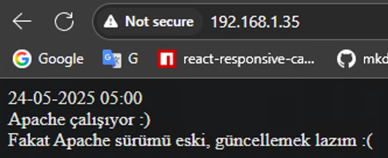
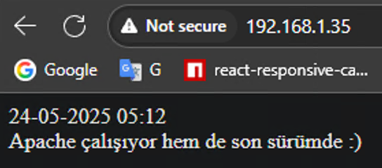

# Linux Sunucu Üzerinde Sistem Performansı, Güvenlik ve Optimizasyon Çalışmaları

Linux sistem yönetimi, hem güvenlik hem de performans açısından düzenli bakım ve optimizasyon gerektiren bir süreçtir. Bu yazıda, bir teknik case kapsamında gerçekleştirdiğim adımları paylaşacağım. Çalışmada; CentOS 7 tabanlı sanal makineye erişim sağlanması ardından, performans sorunlarının giderilmesi, Apache servisinin yönetimi, güvenlik yapılandırmaları ve sistem optimizasyonu üzerine odaklandım.

## 1. Sanal Makine Kurulumu, Ağ Yapılandırması ve Sunucuya Erişim

".ova" dosyası olarak verilen sanal makineyi Virtual Box üzerinde içe aktardım. Ağ olarak Host-Only, Bridge ve NAT Network olmak üzere üç ağ tanımladım. Başlangıçta 1 GB RAM ve 1 CPU tanımladım. İlerleyen işlemlerde 2 GB RAM ve 4 CPU olarak yükselttim.

<!-- truncate -->

Kullanıcı bilgileri olmadığı için Virtual Box üzerindeki MAC adresi ve modemden IP'yi tespit ettim. Aynı ağlarda tanımlı bir Kali Linux makinesinden nmap ile detaylı ağ taramalar yaptım.
`nmap -sn 192.168.1.0/24`
`nmap -sS -p- 192.168.1.35`

```
sudo nmap --script ssh-auth-methods 192.168.1.35
[sudo] password for kali: 
Starting Nmap 7.95 ( https://nmap.org ) at 2025-05-22 21:06 EDT
Nmap scan report for 192.168.1.35
Host is up (0.00097s latency).
Not shown: 987 filtered tcp ports (no-response), 12 filtered tcp ports (host-prohibited)
PORT   STATE SERVICE
22/tcp open  ssh
| ssh-auth-methods: 
|   Supported authentication methods: 
|     publickey
|     gssapi-keyex
|     gssapi-with-mic
|_    password
MAC Address: 08:00:27:C4:63:5B (PCS Systemtechnik/Oracle VirtualBox virtual NIC)
```

SSH oturum açma yöntemlerini kontrol etmek istedim.

```
sudo nmap -sV 192.168.1.35
Not shown: 987 filtered tcp ports (no-response), 12 filtered tcp ports (host-prohibited)
PORT   STATE SERVICE VERSION
22/tcp open  ssh     OpenSSH 7.4 (protocol 2.0)
MAC Address: 08:00:27:C4:63:5B (PCS Systemtechnik/Oracle VirtualBox virtual NIC)
```

Aktif bir güvenlik duvarı olduğunu anladım.

`nmap -sS -p 80,443 192.168.1.35`

```
Starting Nmap 7.95 ( https://nmap.org ) at 2025-05-23 14:36 EDT
Nmap scan report for 192.168.1.35
Host is up (0.0056s latency).

PORT    STATE    SERVICE
80/tcp  filtered http
443/tcp filtered https
MAC Address: 08:00:27:C4:63:5B (PCS Systemtechnik/Oracle VirtualBox virtual NIC)
```

Burada da 80 ve 443 portunu kontrol ettim ve filtreli olarak gözüküyor.

Aynı zamanda ".ova" dosyasındaki ".vmdk" dosyasını sisteme bağlayıp bu yoldan sisteme erişmek istedim fakat sanırım korumalı olduğundan dolayı doğru tanımlasam da mount edemedim.

Daha sonra bir süre boyunca hydra ile rockyou.txt kullanarak şifre kırmayı da denedim. OpenSSH 7.4 sürümüyle ilgili CVE aradım fakat buralardan bir sonuca ulaşamadım ve bu kadar kompleks olmadığını düşündüm.

`hydra -l root -P /usr/share/wordlists/rockyou.txt ssh://192.168.1.35`

Sonra manuel deneyerek `root:******` kombosunu girdim ve erişim sağladım. Senaryo gereceğinde benden istenen asıl giriş yöntemi bu şekilde değildi. GRUB üzerinden kurtarma (şifre sıfırlama işlemi) yapmam isteniyordu. O kısmı yazının sonunda anlatacağım.

## 2. Sistem Performans Sorunları, Anormalliklerin Tespiti ve Apache Servisini Çalışır Hale Getirme

### Sistemdeki anormallik tespiti

Sisteme erişim sağlamaya çalışırken kullandığım makinenin SSD'si 80°C sıcaklıklara ulaştı (normal değerleri 30-40°C). Sistemimdeki SSD yükte fazla ısınan bir model ve pasif soğutucuya sahip değil. Yine de bu kadar ısınması anormal. 

Erişim sağladıktan sonra bazı temel komutları uyguladım.
`cat /etc/passwd` -> başka kullanıcıların tanımlı olup olmadığını öğrenmek için
`ifconfig` -> IP atamalarını kontrol etmek için
`curl google.com` -> internet bağlatısını test etmek için (çalışmadı)
`uname -a`
`Linux c7.******.com 3.10.0-1062.el7.x86_64 #1 SMP Wed Aug 7 18:08:02 UTC 2019 x86_64 x86_64 x86_64 GNU/Linux`

Sistem SSH bağlantısı denerken bile geç tepki veriyordu. Bunu da göz önünde bulundurarak "top" komutuyla işlemleri listeledim ve "stress" isimli işlemi farkettim. Yüksek kaynak tüketimi vardı.

> ℹ️ **Not:** Sistemde "root" olduğum için sudo komutunu kullanmama gerek yok fakat alışkanlık olduğu için rapor genelinde bazı komutları "sudo" ile uyguladım.

`sudo kill -9 687` veya `sudo systemctl stop stress` kullanılabilir

`sudo kill -9 687` , sudo `systemctl disable stress`
komutularıyla ilgili processi kapattım ve disable konuma getirdim ve tekrar kontrol ettiğimde sistem normalleşti. SSD sıcaklığı da düştü.

`free -h`
```
              total        used        free      shared  buff/cache   available
Mem:           991M         98M        844M        692K         48M        798M
Swap:          2.0G         92M        1.9G
```

### İnternet bağlantısını düzeltmek

`curl google.com` komutu çalışmadığı için internete bağlanamadığımı farkettim.
Makine modemden IP alabilmişti. İlk aklıma gelen Linux'teki DNS adreslerinin tutulduğu dosyayı kontrol ettim.
`nano /etc/resolv.conf` ile dosyayı açtım.
`8.8.8.7` olan değeri `8.8.8.8` ile değiştirmeye çalıştım. değiştirirken yetki hatası aldım. Root kullanıcısında bu hatayı almak ve dosyayı kaydedememek biraz şaşırttı ve daha sonra "root" için dosya izinlerini kontrol ettim.


```
[root@c7 ~]# ls -lha /etc/ | grep resolv
-rw-r--r--.  1 root root   19 Apr 21  2020 resolv.conf
```
Daha sonra araştırınca bu dosyanın immutable (değiştirilemez) olarak tanımladığını anladım.

```
lsattr /etc/resolv.conf
----i----------- /etc/resolv.conf
```

`chattr -i /etc/resolv.conf` Çözüm olarak bu komutu uyguladım ve dosyayı tekrar açıp "nameserver" değerini "8.8.8.8" olarak değiştirim, kaydettim.

Tekrar `curl google.com` denedim ve yanıt alabildim. Bağlantı sorunu çözüldü.

### Apache servisini çalıştırmak
Daha sonra bahsedilen README dosyasını okudum. Önce Apache servisinin güncel durumunu ve versiyonunu kontrol ettim. Ve sonra hiç bir değişiklik yapmadan aktif etmeye çalıştım.

```
[root@c7 ~]# sudo systemctl status httpd
● httpd.service - The Apache HTTP Server
   Loaded: loaded (/usr/lib/systemd/system/httpd.service; disabled; vendor preset: disabled)
   Active: inactive (dead)
     Docs: man:httpd(8)
           man:apachectl(8)
```

```
[root@c7 ~]# httpd -v
Server version: Apache/2.4.6 (CentOS)
Server built:   Nov 19 2015 21:43:13
```

```
[root@c7 ~]# sudo systemctl enable httpd
Failed to execute operation: No space left on device
```

### Disk dolu hatası

Sistemin diskinde hiç yer kalmadığı hatasıyla karşılaştım. Önce disk doluluğunu ve inode (dosyaların metadata bilgisi) durumunu kontrol ettim.

`[root@c7 ~]# df -h`
```
Filesystem               Size  Used Avail Use% Mounted on
devtmpfs                 484M     0  484M   0% /dev
tmpfs                    496M     0  496M   0% /dev/shm
tmpfs                    496M  8.0M  488M   2% /run
tmpfs                    496M     0  496M   0% /sys/fs/cgroup
/dev/mapper/centos-root   17G   17G   56K 100% /
/dev/sda1               1014M  136M  879M  14% /boot
tmpfs                    100M     0  100M   0% /run/user/0 
```

`[root@c7 ~]# df -i`
```
Filesystem              Inodes IUsed  IFree IUse% Mounted on
devtmpfs                123862   351 123511    1% /dev
tmpfs                   126853     1 126852    1% /dev/shm
tmpfs                   126853   854 125999    1% /run
tmpfs                   126853    16 126837    1% /sys/fs/cgroup
/dev/mapper/centos-root  47856 47616    240  100% /
/dev/sda1               524288   326 523962    1% /boot
tmpfs                   126853     1 126852    1% /run/user/0
```

Daha sonra büyük boyutlu dosyaları taradım.

`find / -type f -size +100M`
```
/proc/kcore
find: ‘/proc/3584/task/3584/fdinfo/6’: No such file or directory
find: ‘/proc/3584/fdinfo/5’: No such file or directory
/var/tmp/1748046001.bin
/var/tmp/1748046301.bin
/var/tmp/1748046601.bin
/var/tmp/1748046901.bin
/var/tmp/1748047201.bin
/var/tmp/1748047501.bin
/usr/lib/locale/locale-archive
```

tmp dizininde tahminimce sistem saatiyle oluşturulmuş bin dosyalarını buldum. 

Temp dosyaları dışında diğer komutlarla (`sudo yum clean all` veya `sudo truncate -s 0 /var/log/messages` gibi) başka dosyaları sistemin kararlılığını bozma ihtimali olduğundan silmek, sıfırlamak istemedim. 

`/var/tmp` dizinindeki dosyaları sildim. Tekrar kontrol ettim. Kullanımlar düştü

Önce `ls -lh /var/tmp/` ile dosyaların varlığını tekrar kontrol ettim. 
Sonra `rm -f /var/tmp/*` ile sildim.

`[root@c7 ~]# df -h`
```
Filesystem               Size  Used Avail Use% Mounted on
devtmpfs                 484M     0  484M   0% /dev
tmpfs                    496M     0  496M   0% /dev/shm
tmpfs                    496M  8.2M  488M   2% /run
tmpfs                    496M     0  496M   0% /sys/fs/cgroup
/dev/mapper/centos-root   17G  1.6G   16G  10% /
/dev/sda1               1014M  136M  879M  14% /boot
tmpfs                    100M     0  100M   0% /run/user/0
[root@c7 ~]# df -i
Filesystem               Inodes IUsed   IFree IUse% Mounted on
devtmpfs                 123862   351  123511    1% /dev
tmpfs                    126853     1  126852    1% /dev/shm
tmpfs                    126853   922  125931    1% /run
tmpfs                    126853    16  126837    1% /sys/fs/cgroup
/dev/mapper/centos-root 8910848 47590 8863258    1% /
/dev/sda1                524288   326  523962    1% /boot
tmpfs                    126853     1  126852    1% /run/user/0
```

### Otomatik tmp temizliği ayarlanması

Oluşan temp dosyalarını otomatik silmek için şunları uyguladım.

`sudo EDITOR=nano crontab -e` içerisine (veya vim ile ekledikten sonra :wq)
`crontab: installing new crontab`

`* * * * * find /var/tmp/ -name "*.bin" -type f -mmin +1 -delete` 
komutu eklenebilir.

1 dakikadan eski dosyaları temizleyecek.

Burada senaryo gereği tanımlanmış görevleri kapatmadım.

Disk sorunu kalıcı olarak çözdükten sonra tekrar "httpd" servisini çalıştırmayı denedim.

### Tekrardan Apache servisini çalıştırmak

`systemctl start httpd`
```
Job for httpd.service failed because the control process exited with error code. See "systemctl status httpd.service" and "journalctl -xe" for details.
```

hatası aldım ve ilgili logları kontrol ettim.

`systemctl status httpd.service`
```
● httpd.service - The Apache HTTP Server
   Loaded: loaded (/usr/lib/systemd/system/httpd.service; disabled; vendor preset: disabled)
   Active: failed (Result: exit-code) since Sat 2025-05-24 03:11:48 +03; 22s ago
     Docs: man:httpd(8)
           man:apachectl(8)
  Process: 1553 ExecStop=/bin/kill -WINCH ${MAINPID} (code=exited, status=1/FAILURE)
  Process: 1552 ExecStart=/usr/sbin/httpd $OPTIONS -DFOREGROUND (code=exited, status=1/FAILURE)
 Main PID: 1552 (code=exited, status=1/FAILURE)

May 24 03:11:42 c7.******.com systemd[1]: Starting The Apache HTTP Server...
May 24 03:11:48 c7.******.com httpd[1552]: (2)No such file or directory: AH02291: Cannot access directory ...r log
May 24 03:11:48 c7.******.com httpd[1552]: AH00014: Configuration check failed
May 24 03:11:48 c7.******.com systemd[1]: httpd.service: main process exited, code=exited, status=1/FAILURE
May 24 03:11:48 c7.******.com kill[1553]: kill: cannot find process ""
May 24 03:11:48 c7.******.com systemd[1]: httpd.service: control process exited, code=exited status=1
May 24 03:11:48 c7.******.com systemd[1]: Failed to start The Apache HTTP Server.
May 24 03:11:48 c7.******.com systemd[1]: Unit httpd.service entered failed state.
May 24 03:11:48 c7.******.com systemd[1]: httpd.service failed.
Hint: Some lines were ellipsized, use -l to show in full.
```

Sorunu araştırdığımda `/var/log/httpd` dizinin var olmadığını anladım.
`ls -ld /var/log/httpd` ile kontrol ettim.
`mkdir -p /var/log/httpd` ile dizini oluşturdum.

`ls -ld /var/log/httpd`
`drwxr-xr-x. 2 root root 6 May 24 03:43 /var/log/httpd`

Apache servisine bu dizin için izinler verdim.

`sudo chown apache:apache /var/log/httpd`
`sudo chmod 755 /var/log/httpd`


yapılandırmayı test ettim

```
[root@c7 ~]# sudo apachectl configtest
Syntax OK
```

```
sudo systemctl enable httpd
sudo systemctl start httpd 
```

Bu denemede servis ayağa kalktı fakat web sitesine host makinesinden bağlanamadım. Güvenlik duvarını kontrol ettim.

`sudo firewall-cmd --list-all`
```
public (active)
  target: default
  icmp-block-inversion: no
  interfaces: enp0s3 enp0s8
  sources:
  services: dhcpv6-client ssh
  ports:
  protocols:
  masquerade: no
  forward-ports:
  source-ports:
  icmp-blocks:
  rich rules:
```
Daha sonra portları kontrol ettim ve açık olması gereken portlar açıktı.


`sudo ss -tuln`
```
Netid  State      Recv-Q Send-Q            Local Address:Port                           Peer Address:Port
udp    UNCONN     0      0                             *:68                                        *:*
tcp    LISTEN     0      100                   127.0.0.1:25                                        *:*
tcp    LISTEN     0      128                           *:22                                        *:*
tcp    LISTEN     0      100                       [::1]:25                                     [::]:*
tcp    LISTEN     0      128                        [::]:80                                     [::]:*
tcp    LISTEN     0      128                        [::]:22    
```

CentOS makinesinde `curl http://192.168.1.35` yazarak kendi içerisinde istek atmayı denedim ve şu çıktıyla karşılaştım.

`curl 192.168.1.35`
```
<!DOCTYPE HTML PUBLIC "-//IETF//DTD HTML 2.0//EN">
<html><head>
<title>403 Forbidden</title>
</head><body>
<h1>Forbidden</h1>
<p>You don't have permission to access /index.html
on this server.</p>
</body></html>
```

Apache yapılandırmasını kontrol ettim.

`sudo nano /etc/httpd/conf/httpd.conf`

Sadece "Listen 80" var, 443 portunu daha sonra ekleyeceğim.

html dosyasının izinlerini kontrol ettim.
`ls -l /var/www/html/index.html`
`-rw-------. 1 root root 0 May 24 04:04 /var/www/html/index.html`

`ls -ld /var/www/html`
`drwxr-xr-x. 2 root root 24 Apr 21  2020 /var/www/html`

"index.html" dosyasının izinlerinin eksik ve yanlış olduğunu farkettim.

```
sudo chown apache:apache /var/www/html /var/www/html/index.html
sudo chmod 644 /var/www/html/index.html
sudo chmod 755 /var/www/html
```

komutlarını uyguladıktan sonra tekrar kontrol ettim.
`ls -l /var/www/html/index.html`
`-rw-r--r--. 1 apache apache 0 May 24 04:06 /var/www/html/index.html`


```
sudo apachectl configtest
sudo systemctl restart httpd
sudo systemctl enable httpd
```

komutlarını uyguladım. Hata almadım

`sudo systemctl status httpd`

```
● httpd.service - The Apache HTTP Server
   Loaded: loaded (/usr/lib/systemd/system/httpd.service; enabled; vendor preset: disabled)
   Active: active (running) since Sat 2025-05-24 04:50:12 +03; 1min 9s ago
     Docs: man:httpd(8)
           man:apachectl(8)
  Process: 4868 ExecStop=/bin/kill -WINCH ${MAINPID} (code=exited, status=0/SUCCESS)
 Main PID: 4872 (httpd)
   Status: "Total requests: 5; Current requests/sec: 0; Current traffic:   0 B/sec"
   CGroup: /system.slice/httpd.service
           ├─4872 /usr/sbin/httpd -DFOREGROUND
           ├─4878 /usr/sbin/httpd -DFOREGROUND
           ├─4879 /usr/sbin/httpd -DFOREGROUND
           ├─4880 /usr/sbin/httpd -DFOREGROUND
           ├─4881 /usr/sbin/httpd -DFOREGROUND
           └─4882 /usr/sbin/httpd -DFOREGROUND

May 24 04:50:07 c7.******.com systemd[1]: Starting The Apache HTTP Server...
May 24 04:50:12 c7.******.com systemd[1]: Started The Apache HTTP Server.
```

### Firewall yapılandırması
şimdi tekrar `sudo firewall-cmd --list-all` ile kontrol ettim fakat yine "http" "https" göremedim. 
```
sudo firewall-cmd --permanent --add-service=http
success
```
```
sudo firewall-cmd --permanent --add-service=https
success
```
`sudo firewall-cmd --reload`

komutlarıyla ekledim ve yeniden başlattım. Host makineden bu sefer bağlanmayı başardım.



Daha önceden `cat /var/www/html/index.html` ile içeriğini kontrol ettiğim sayfayı görüntülemeyi başardım. Şimdi Apache sürümünü güncellemem gerekiyor.

Kali Linux ile tekrar port taraması yaptım.
```
PORT    STATE  SERVICE VERSION
22/tcp  open   ssh     OpenSSH 7.4 (protocol 2.0)
80/tcp  open   http    Apache httpd 2.4.6 ((CentOS))
443/tcp closed https
```

## 3. Apache Servisini Güncelleme

`yum install epel-release` komutu, mirrorlist.centos.org adresine erişemiyor ve 404 hataları veriyor. Bunun sebebi CentOS 7’nin 1 Temmuz 2024’te End of Life (EOL) tarihi nedeniyle depoların vault.centos.org’a taşınmasından kaynaklanıyor.

Bu yüzden repo'ları güncelledim. Sırasıyla

```
sudo sed -i 's/mirror.centos.org/vault.centos.org/g' /etc/yum.repos.d/CentOS-*.repo
sudo sed -i 's|^#.*baseurl=http|baseurl=http|g' /etc/yum.repos.d/CentOS-*.repo
sudo sed -i 's|^mirrorlist=http|#mirrorlist=http|g' /etc/yum.repos.d/CentOS-*.repo
```
ve yum önbelleğini temizledim.

```
sudo yum clean all
sudo yum makecache
```

EPEL Deposunu tekar yüklemeyi denedim.

`yum install epel-release`

`yum info httpd`
```
Loaded plugins: fastestmirror
Loading mirror speeds from cached hostfile
 * epel: ftp-stud.hs-esslingen.de
Installed Packages
Name        : httpd
Arch        : x86_64
Version     : 2.4.6
Release     : 40.el7.centos
Size        : 9.4 M
Repo        : installed
From repo   : /httpd-2.4.6-40.el7.centos.x86_64y9Fcho
Summary     : Apache HTTP Server
URL         : http://httpd.apache.org/
License     : ASL 2.0
Description : The Apache HTTP Server is a powerful, efficient, and extensible
            : web server.
```

Tekrar denedim. Yine hata aldım.

`[root@c7 ~]# sudo yum update httpd`
```
Loaded plugins: fastestmirror
Loading mirror speeds from cached hostfile
 * epel: ftp-stud.hs-esslingen.de
No packages marked for update
```

Daha güncel olan IUS repo'su ile değiştirdim.

```
sudo yum install https://repo.ius.io/ius-release-el7.rpm
sudo yum install yum-plugin-replace
sudo yum replace httpd --replace-with httpd24u
```
ve Apache'yi de daha güncel olanla değiştirdim.

Daha sonra yeniden başlatmayı denedim ve çalıştı.

`systemctl restart httpd`

Web sayfasında istenen mesajı görüntülemeyi başardım.



Güncel sürüm:

`yum info httpd24u`
```
Loaded plugins: fastestmirror, replace
Loading mirror speeds from cached hostfile
 * epel: mirrors.hostiserver.com
Installed Packages
Name        : httpd24u
Arch        : x86_64
Version     : 2.4.58
Release     : 1.el7.ius
Size        : 4.5 M
Repo        : installed
From repo   : ius
Summary     : Apache HTTP Server
URL         : https://httpd.apache.org/
License     : ASL 2.0
Description : The Apache HTTP Server is a powerful, efficient, and extensible
            : web server.
```

Sürümlerden yıllarını kontrol ettim, eski sürüm 2013 zamanlarından yeni sürüm ise 2023 yılından.

### 443 Portunu Açma
`nano /etc/httpd/conf/httpd.conf`
Listen 443 satırı eklendi ve artık 443 te çalışıyor.

```
[root@c7 ~]# ss -tuln
Netid  State      Recv-Q Send-Q            Local Address:Port                           Peer Address:Port
udp    UNCONN     0      0                             *:68                                        *:*
tcp    LISTEN     0      100                   127.0.0.1:25                                        *:*
tcp    LISTEN     0      128                           *:22                                        *:*
tcp    LISTEN     0      100                       [::1]:25                                     [::]:*
tcp    LISTEN     0      128                        [::]:443                                    [::]:*
tcp    LISTEN     0      128                        [::]:80                                     [::]:*
tcp    LISTEN     0      128                        [::]:22                                     [::]:*
```

Kali Linux ile kontrol ettiğimde de durum güncellendi.
80/tcp  open   http    Apache httpd 2.4.58 ((IUS))
443/tcp open  http	Apache httpd 2.4.58 ((IUS)) 

## 4. Sistem Optimizasyonu

Sistemi daha fazla optimize etmek için paketleri ve processleri inceledim.

```
rpm -qa | wc -l
381 
```

381 paket var, çalışan processleri listeledim.

`sudo systemctl list-units --type=service --state=running`

```
UNIT                     LOAD   ACTIVE SUB     DESCRIPTION
auditd.service           loaded active running Security Auditing Service
crond.service            loaded active running Command Scheduler
dbus.service             loaded active running D-Bus System Message Bus
firewalld.service        loaded active running firewalld - dynamic firewall daemon
getty@tty1.service       loaded active running Getty on tty1
httpd.service            loaded active running The Apache HTTP Server
lvm2-lvmetad.service     loaded active running LVM2 metadata daemon
network.service          loaded active running LSB: Bring up/down networking
polkit.service           loaded active running Authorization Manager
postfix.service          loaded active running Postfix Mail Transport Agent
rsyslog.service          loaded active running System Logging Service
sshd.service             loaded active running OpenSSH server daemon
systemd-journald.service loaded active running Journal Service
systemd-logind.service   loaded active running Login Service
systemd-udevd.service    loaded active running udev Kernel Device Manager
tuned.service            loaded active running Dynamic System Tuning Daemon

LOAD   = Reflects whether the unit definition was properly loaded.
ACTIVE = The high-level unit activation state, i.e. generalization of SUB.
SUB    = The low-level unit activation state, values depend on unit type.

16 loaded units listed. Pass --all to see loaded but inactive units, too.
To show all installed unit files use 'systemctl list-unit-files'.
```

Burada "postfix.service" dikkatimi çekti ve kapattım.
```
sudo systemctl stop postfix
sudo systemctl disable postfix
Removed symlink /etc/systemd/system/multi-user.target.wants/postfix.service.
```

`ss -tuln` ile tekrar kontrol ettim ve 25 portu da kapandı.

```
ss -tuln
Netid  State      Recv-Q Send-Q            Local Address:Port                           Peer Address:Port
udp    UNCONN     0      0                             *:68                                        *:*
tcp    LISTEN     0      128                           *:22                                        *:*
tcp    LISTEN     0      128                        [::]:443                                    [::]:*
tcp    LISTEN     0      128                        [::]:80                                     [::]:*
tcp    LISTEN     0      128                        [::]:22                                     [::]:*
```

Portları bir web server için uygun şekilde ayarladıktan sonra Apache'yi optimize etmek istedim.

`sudo nano /etc/httpd/conf/httpd.conf`

içerisine şunları ekledim:
```
KeepAlive On
MaxKeepAliveRequests 100
KeepAliveTimeout 5
```

1. KeepAlive On sunucuya gelen isteğin hemen kapanmamasını ve diğer dosyaların da aç kapa yapmadan yüklenmesini sağlar. 
2. MaxKeepAliveRequests 100 aynı bağlantı üzerinden maksimum 100 HTTP isteği gönderilmesini devamı için yeniden bağlantı açılmasını sağlar. DoS saldırılarını sınırlandırır.
3. KeepAliveTimeout 5 eğer yeni istek gelmezse bağlantıyı kapatır. Sunucu kaynağının boşa harcanmasını engeller.

`sudo systemctl restart httpd`

Daha sonra optimizasyon ve linux hardening konularını biraz daha araştırarak Apache'nin boş dizin listelemesini engellemek için
/etc/httpd/conf/httpd.conf içerisindeki bu kısımda Indexes değerini sildim.

```
<Directory "/var/www/html">
    Options ~~Indexes~~ FollowSymLinks
    AllowOverride None
    Require all granted
</Directory>
```

## 5. Sistem Güvenliği, SSH, SSL Yapılandırması ve Root Dışında Kullanıcı Oluşturma

Sistemin daha güvenli hale gelmesi için SSH doğrulamasında şifre ile girişi kapatmalıyım ve SSH portunu değiştirmeliyim. Ek olarak root olarak sunucuya erişmek yerine
"adminuser" adında bir kullanıcı oluşturarak onunla giriş yapmak olası saldırı senaryolarında sistem için daha güvenli bir yol.

### Kullanıcı oluşturma

```
sudo adduser adminuser
sudo passwd adminuser 
```

adminuser:passwd40

Henüz kullanıcıyı "root" grubuna eklemeden `sudo su` denedim ve loglandı.

`sudo usermod -aG wheel adminuser`

> ℹ️ **Not:** Sistemde daha önceden oluşturulmuş testuser'ı maalesef işlemler bittikten sonra farkettim.

### SSH yapılandırması

Öncelikle SSH'a root olarak bağlanmayı kapattım.

`sudo nano /etc/ssh/sshd_config`

"PermitRootLogin" satırını yorum satırından çıkardım ve değeri "no" yaptım.

"PubkeyAuthentication yes" yaptım. "ChallengeResponseAuthentication no" olarak varsayılan bıraktım.

Daha sonra Host makinemde Git Bash ile SSH anahtarı oluşturdum. "passphrase" kısmını enter ile geçtim.

`ssh-keygen -t rsa -b 4096 -f ~/.ssh/centos_key`

Daha sonra `ssh-copy-id -i ~/.ssh/centos_key adminuser@192.168.1.35` komutuyla Host makinemden CentOS'a bağlandım.

Windows Terminal için: `ssh -i C:\Users\Berk\.ssh\centos_key adminuser@192.168.1.35`

Git Bash için: `ssh -i /c/Users/Berk/.ssh/centos_key 'adminuser@192.168.1.35'`

komutlarıyla giriş yaptım.

Ve şifre ile girişi kapatmak için "PasswordAuthentication no" olarak ayarladım. 

`sudo systemctl restart sshd` ile SSH servisini yeniden başlattım.

Tekrar şifre ile bağlanmayı denediğimde başarılı şekilde "Permission denied" hatası aldım.


### SELinux kontrolü

NOT: SSH güvenliği için varsayılan portu 2222 ile değiştirmeyi denedim fakat servisi yeniden başlatırken "Permission denied" hatasıyla karşılaştım. Bir kaç deneme yapsam da çözüm bulamadım. SELinux ile alakalı satırı da güncelledim fakat yine olmadı. Tahminimce "enforcing" modda olduğundan izin vermiyor.

```
[root@c7 ~]# getenforce 
Enforcing
```

```
[root@c7 adminuser]# sestatus
SELinux status:                 enabled
SELinuxfs mount:                /sys/fs/selinux
SELinux root directory:         /etc/selinux
Loaded policy name:             targeted
Current mode:                   enforcing
Mode from config file:          enforcing
Policy MLS status:              enabled
Policy deny_unknown status:     allowed
Max kernel policy version:      31

[root@c7 adminuser]# ls -Z /etc/ssh/sshd_config
-rw-------. root root system_u:object_r:etc_t:s0       /etc/ssh/sshd_config

```
### SSL Sertifika yapılandırması

SSL Sertifikası yapılandırmak için 
`sudo yum install mod_ssl`
daha sonra aşağıdaki komutla self-signed sertifika oluşturdum. Host makinemde güvenilir olarak gözükmemesinin nedeni CA tarafından tanınmaması.

```
sudo openssl req -x509 -nodes -days 365 -newkey rsa:2048 -keyout /etc/pki/tls/private/selfsigned.key -out /etc/pki/tls/certs/selfsigned.crt
Generating a 2048 bit RSA private key
```
```
..........................................+++
...........................................................................................+++
writing new private key to '/etc/pki/tls/private/selfsigned.key'
-----
You are about to be asked to enter information that will be incorporated
into your certificate request.
What you are about to enter is what is called a Distinguished Name or a DN.
There are quite a few fields but you can leave some blank
For some fields there will be a default value,
If you enter '.', the field will be left blank.
-----
Country Name (2 letter code) [XX]:TR
State or Province Name (full name) []:Ankara
Locality Name (eg, city) [Default City]:city
Organization Name (eg, company) [Default Company Ltd]:company
Organizational Unit Name (eg, section) []:
Common Name (eg, your name or your server's hostname) []:centos
Email Address []:example@mail.com
```
ve şifreli haberleşme için gelen HTTP isteklerini HTTPS'e yönlendirmem gerekli.

`nano /etc/httpd/conf.d/ssl.conf` ile ilgili dosyayı oluşturarak içerisine

```
<VirtualHost *:80>
    ServerName 192.168.1.35
    Redirect permanent / https://192.168.1.35/
</VirtualHost>

<VirtualHost *:443>
    SSLEngine on
    SSLCertificateFile /etc/pki/tls/certs/selfsigned.crt
    SSLCertificateKeyFile /etc/pki/tls/private/selfsigned.key

    DocumentRoot /var/www/html
    ServerName 192.168.1.35

</VirtualHost>
```

### HTTP > HTTPS yönlendirmesi

Yönlendirme için `nano /etc/httpd/conf/httpd.conf` içerisine şu kısmı ekledim:

```
<VirtualHost *:80>
    ServerName 192.168.1.35
    Redirect permanent / https://192.168.1.35/
</VirtualHost>
```


## 6. Güncellemeler ve Yapılabilecek Geliştirmeler

`sudo yum check-update` ile güncellenebilir paketleri kontrol ettikten sonra
```
ansible.noarch                                                 2.9.27-1.el7                                      epel
python2-jmespath.noarch                                        0.9.4-2.el7                                       epel
stress.x86_64                                                  1.0.4-16.el7                                      epel
Obsoleting Packages
python2-httplib2.noarch                                        0.18.1-3.el7                                      epel
python-httplib2.noarch                                     0.9.2-1.el7                                       @extras
```
`sudo yum update` ile güncelledim.

Geliştirme kısmında ise yedeklemelere dikkat edilebilir. Sistem belli bir planda yedeklenmeli ve farklı bir ortamda saklanmalı. Bunun yanında WAF (Web Application Firewall)
ile SQL injection, XSS gibi olası web saldırıları filtrelenebilir. SSH için brute-force denemelerini kayıt tutan ve engelleyen araçlar kullanılabilir.

## 7. GRUB ile Şifre Sıfırlama

Eğer şifreyi bulmasaydım; Sisteme fiziksel erişimim olduğundan geriye denemediğim GRUB menü aracılığı ile giriş yöntemi kalıyor. 
Bu yöntem, Linux sistemde "root" şifresi unutulduğunda GRUB üzerinden "init=/bin/bash" yöntemiyle root shell'e ulaşarak parolayı sıfırlama işlemidir. GRUB menüsünde açılış satırını düzenliyoruz ve sistem doğrudan bash shell ile başlıyor. Bunu uygulamak için GRUB menüde henüz boot aşamasındayken "e" tuşuna basarak normal CentOS boot'unu düzenleyeceğimiz kısma giriyoruz. Daha sonra aşağı iniyoruz ve şu satırı düzenliyoruz:

`linux16 /vmlinuz-3.10.0-1062.el7.x86_64 root=/dev/mapper/centos-root ro crashkernel=auto rd.lvm.lv=centos/root rd.lvm.lv=centos/swap rhgb quiet LANG=en_US.UTF-8`

Bu satırdaki "ro, rhgb, quiet" kısımlarını siliyoruz. 

Yerine `rw init=/bin/bash` ekliyoruz. 

`linux16 /vmlinuz-3.10.0-1062.el7.x86_64 root=/dev/mapper/centos-root rw init=/bin/bash crashkernel=auto rd.lvm.lv=centos/root rd.lvm.lv=centos/swap LANG=en_US.UTF-8`

Haline getirdim.

Bu sayede "rw" ile sistem yazılabilir hale geldi ve sistemin tüm çıktılarını, tepkilerini görmek için rhgb ve quiet parametrelerini kaldırdık.
>Bilerek önce rhgb ve quiet kaldırmadan denedim ve sistem kernel panic moduna girdi.

CTRL + X ile sistemi başlatıyoruz ve sisteme root olarak giriş yaptık.

`sudo su` bazı komutları çalıştırmak için yazılabilir.

daha sonra `mount -o remount,rw /` yazıyoruz ve diski yazılabilir hale getiriyoruz.

Bu aşamada servisler çalışmıyor.

Daha sonra `passwd root` ile root şifresini değiştirdim.

sonra `touch /.autorelabel` ile selinux için yeniden etiketleme dosyası oluşturuyoruz. Bunu yapmadan /etc/shadow güncellenmiyor ve sisteme giriş yapmıyor.

daha sonra `reboot -f`

veya Rescue modunda açarak, aynı kısmı 
```
rw rd.break enforcing=0 ile değiştirerek
mount -o remount,rw /sysroot
chroot /sysroot
passwd root
touch /.autorelabel
reboot -f 
```
ile aynı işlemi gerçekleştirebiliriz.
İki yöntemde de aynı sonuca ulaşmayı başardım.

## Sonuç

En son kaynak tüketimi verisi:
```
[root@c7 adminuser]# free -h
              total        used        free      shared  buff/cache   available
Mem:           1.8G        164M        1.5G        8.6M        180M        1.5G
Swap:          2.0G          0B        2.0G
```

`sudo tar -czf /tmp/etc-root-backup.tar.gz /etc /root` ile ilgili dizinleri paketledim.

Host makinemde `scp adminuser@192.168.1.35:/tmp/etc-root-backup.tar.gz .` komutuyla Host makineye kopyaladım.

Özet olarak bu projede sistemde anormallik tespiti, internet bağlantısının düzeltilmesi, Apache servisinin çalıştırılması, disk hatalarının kontrolü ve geçici dosyaların temizliği, firewall yapılandırması, Apache güncellemeleri, sistem optimizasyonu, SSH ve SSL yapılandırmaları, root dışı kullanıcı yönetimi, HTTP’den HTTPS’ye yönlendirme ve sistem güncellemeleri gibi temel güvenlik ve performans iyileştirmelerini başarıyla gerçekleştirdim. Uygularken daha önce uygulamadığım komutlarla karşılaştım ve yine araştırarak ilerledim. Bu şekilde uygulamalı bir case öğrenmek için oldukça verimli oldu.

[Github](https://www.github.com/berkercelik)

[Blog](https://berkercelik.github.io/b-log)

[LinkedIn](https://www.linkedin.com/in/berkaliercelik/)